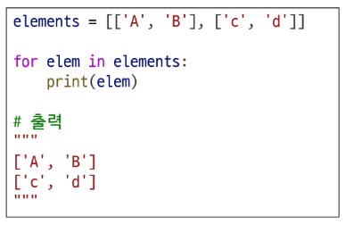

**모듈 : 한 파일로 묶인 변수와 함수의 모음**

**특정 기능을 하는 코드가 작성된 파이썬 파일(.py)**


**Import 문 사용**

같은 이름의 함수가 여러 모듈에 있을 때 충돌을 방지할 수 있음

'.(dot)' 연산자를 통해서 그 안에 있는 속성 값에 접근

"점의 왼쪽 객체에서 점의 오른쪽 이름을 찾아라"는 의미

```
import math 


print(math.pi) #모듈명.변수명

print(math.sqrt(4)) #모듈명.함수명

```

**from 절 사용**

장점: 코드가 짧고 간결해짐

```

from math import pi, sqrt


print(pi)

print(sqrt(4))

```


단점 :

* 정의된 모듈의 위치를 알기 어려워 명시적이지 않을 수 있음
* 사용자가 선언한 변수 또는 함수와 겹치게 된다면 모듈에서 정의한 값이나 동작이 이루어지지 않을 수 있음
* 유사한 사례 : print라는 이름의 변수를 배정하면 print 함수를 못 쓰게 되는 것


```
from math import sqrt

math\_result = sqrt(16)


def sqrt(x)

&nbsp;	return str(x \*\* 0.5)

my\_result = sqrt(16)
```

---

from절 사용 시 주의사항


마지막에 import 된 것이 이전 것을 덮어쓰기 때문에, 나중에  import 된 것만 유효하게 되므로
**서로 다른 모듈에서 import된 변수나 함수의 이름이 같은 경우 이름 충돌 발생 주의**


\- 모든 요소를 한번에 import하는 \* 표기는 권장하지 않음

---

'as' 키워드

: as 키워드를 사용하여 별칭(alias)을 부여

* 두 개 이상의 모듈에서 동일한 이름의 변수, 함수 클래스 등을 가져올 때 발생하는 이름 충돌 해결
* import 되는 함수나 변수명이 너무 길거나 자주 사용해야 할 경우 'as' 키워드를 사용하여 별칭(alias)을 정의해 쉽게 사용


```
from math import sqrt

from my\_math import sqrt as my\_sqrt


print(sqrt(4))  # 2.0

print(my\_sqrt(4))  # 2.0

```

---

\# 사용자 정의 모듈


> my\_math.py
```
def add(x, y):

&nbsp;   return x + y


def sqrt(x):

&nbsp;   return x\*\*0.5
```

## 사용자 정의 모듈
```
import my\_math


\# from my\_math import add


print(my\_math.add(1, 2))

\# print(add(1, 2))
```


## 사용자 정의 패키지
```
from my\_package.math import my\_math

from my\_package.statistics import tools


print(my\_math.add(1, 2))

print(tools.mod(1, 2))

```

# 패키지

: 연관된 모듈들을 하나의 디렉토리에 모아 놓은 것 (폴더 혹은 코드 꾸러미와 같은 역할)

- 직접 만드는 패키지
  
  너무 많은 기능이 한 파일에 몰려 있으면 사용자가 헷갈릴 수 있음

  비슷한 기능은 묶고, 관련 없는 것은 나누는 것이 사용하기 편함

  폴더/파일명에는 소문자+언더스코어(\_)를 쓰는 게 표준


\# 파이썬 표준 라이브러리(PSL) 내부 패키지

* 파이썬을 설치하면 자동으로 사용 가능한 기본 패키지
* 설치 없이  바로 import해서 사용 가능


\#  파이썬 외부 패키지

* 필요한 기능을 사용하기 위해 직접 설치해서 쓰는 패키지
* 사용할 패키지를 설치할 때는 'pip' 사용


라이브러리>패키지>모듈

라이브러리는 다양한 패키지들을 포함하는 상위 개념


패키지 설치에 있어, 최신 버전/특정 버전/최소 버전을 명시하여 설치할 수 있음

호환성 이슈가 생기지 않는지 확인 필요


requests패키지

파이썬에서 웹에 요청을 보내고 응답을 받는 걸 아주 쉽게 만들어주는 외부 패키지

API 주고받을 때 사용

** 추가 개념 알기
.get(url)
.json()


패키지 사용 목적

: 모듈들의 이름공간을 구분하여 충돌 방지/모듈들을 효율적으로 관리하고  할 수 있도록 돕는 역할

---

\# 제어문

: 코드의 실행 흐름을 제어하는 데 사용되는 구문

**조건**에 따라 코드 블록을 실행하거나 **반복**적으로 코드 실행

조건문

: 주어진 조건식을 평가하여 해당 조건이 참인 경우에만 코드 블록을 실행하거나 건너뜀

if/elif(else if)/else

반복문
for 반복/while 반복


---
# 조건문 

if 문

1. 조건문 기본 형태
2. 작성되는 조건은 **표현식**으로 작성
3. 조건 충족하면 내부 코드 실행

반드시 if, elif, else의 구조를 지킬 필요는 없음. if만 있어도 된다면 그것만 활용해도 됨

```

score = 100

if score > 95 :

  print('축하합니다')

else:

   print('수고하셨습니다')

```

elif문

: 이전 조건을 만족하지 못하고 추가로 다른 조건이 필요할 때 사용/여러 개 사용 가능

else문

: 모든 조건들을 만족하지 않으면 실행

score = 90

if score >95:
    print("축하합니다")
    print(score) #들여쓰기에 따라 위  if 조건에 영향받게 됨.

    #들여쓰기 안 하면  score=90이 됨

    if  두개 쓰는 거랑 if else 쓰는 건 다름

---

복수 조건문을 쓸 때에는 조건식을 동시에 검사하는 것이 아닌 '순차적' 비교가 될 수 있도록 설계 > 만족하는 조건식만 실행하고 종료

39슬라이드 오른쪽은 모두 if라서 모두 실행됨.
각각 별개의 조건문이 되기 때문. 들여쓰기로 구분하여 상위 하위 조건문 관계가 설정됨

조건식의 순서에 따라 원하는 결과가 나오지 않을 수 있음


중첩 조건문은 조건문 내부에 또 다른 조건문을 작성하여 만들어짐


---

\# 반복문

: 주어진 코드 블록을 여러 번 반복해서 실행하는 구문


for문

* 반복 가능한 객체 요소들을 반복하는 데에 주로 사용
* 주로 반복 가능한 **객체 요소의 개수**만큼 반복
* 특징 :  반복 횟수가 정해져 있음


while문

* while 조건이 참(True)인 동안(= False가 될 때까지) 반복
* 반복 횟수가 정해지지 않은 경우 주로 사용
* 무한 호출, 무한 반복에 주의하여야 함
* 조건식으로 제어

반복문 제어 키워드
: 내부에서 반복문의 흐름을 제어할 수 있는 키워드
- break : 남은 코드 무시하고 반복문 종료
- continue : 다음 코드 무시하고 반복문 처음으로 돌아가 다음 반복 수행

빈 코드 블록 키워드
: 코드 구조상 문장이 필요하지만, 실행할 코드가 없거나 일시적으로 비워둘 때 사용 (=빈칸)
pass : 아무 동작 하지 않음을 명시적으로 표시

---

\# for 반복문

: 반복 가능한 객체의 요소들을 반복하는 데에 사용

반복 가능한 객체의 요소 개수만큼 반복이 수행


```
for 변수 in 반복 가능한 객체:

  	코드 블록
```


**iterable(반복 가능한 객체)**

: 요소를 하나씩 반환할 수 있는 모든 객체 ( 반복문에서 순회 가능한 객체)

시퀀스 자료형뿐 아니라 비시퀀스 자료형(dict, set)도 가능


item\_list = \['apple', 'banana', 'coconut']


for item in item\_list:  # item: 반복 변수(임시변수 = 반복 변수)

    print(item)


변수가 복수일 때, 반복 변수를 단수로 설정하는 것이 좋음

--

문자열 순회

변수 = '이름'

for char in 변수:
  print(char)

---

range 순회

특정 숫자 범위만큼 반복을 하고 싶을 때 range 함수 사용

---

dict 순회

dict 자료형은 비시퀀스 자료형으로 반복 순서가 보장되지 않음을 유의
동작하기 위한 순서는 있지만, 중요하지 않은 것

key가 기본출력, 값은 my\_dict\[key]로 접근


인덱스로 리스트 순회

\[]

range(길이(시퀀스))를 인덱스로 쓰면 정확하게 범위가 나옴
- 리스트의 요소가 아닌 인덱스로 접근하여 해당 요소들을 변경
- 리스트의 원하는 위치에 있는 값을 읽거나 변경 가능

---

> 중첩된 반복문 개념 다시 정리하기

큰 반복과 작은 반복으로 이해해보기

---

# 중첩 리스트 순회

* 안쪽 리스트 요소에 접근하려면 바깥 리스트를 순회하면서 중첩 반복을 사용해 각 안쪽 반복을 순회



크게 인덱스를 1,2로 보고, 작은 리스트에도 각각 인덱스를 부여해
elem이 item이 되면 각각 배분되듯이 조합하여 제시


IM 시험은  2차원 리스트를 잘 다루는 것..공부하기!!!

---

# while 문
(반복 횟수 예상 불가)

주어진 조건식이 참인 동안 코드를 반복해서 실행

&nbsp;                                                  ==

조건식이 거짓이 될 때까지 반복해서 실행
조건식이 참이면 코드 블록을 실행하고 거짓일 때 반복이 종료하기 때문


while True로 돌려놓고 사용자 입력에 따른 종료를 진행하기도 함

반드시 종료 조건이 필요함

언젠가는 반드시  False 가 되도록 반복문 내부에서 변수 값을 변화시키는 게 좋음

조건에서 사용할 변수를 반드시 초기화해야 오류를 방지할 수 있음


```

a= 0


while a<3:

&nbsp;   print(a)

&nbsp;   a+= 1

```

False 조건은 a=3임을 알 수 있음

---
'반드시 **종료 조건**이 필요'

종료조건이 없는 경우 무한 반복에 빠지게 되어 원하는 동작을 하지 않게 됨
---

69슬라이드 손필기!👏


---

\# 반복 제어

: for문과 while은 매 반복마다 본문 내 모든 코드를 실행하지만 때때로 일부만 실행하는 것이 필요할 때가 있음


break 키워드

: 남은 코드(=break문 아래 코드)를 무시하고 반복 즉시 종료

* 반복을 끝내야 할 명확한 조건이 있을 때 사용

&nbsp;

for i in range(10):

&nbsp;   if i == 5:

&nbsp;       break

&nbsp;   print(i)  # 0 1 2 3 4


continue 키워드

: 남은 코드를 진행하지 않고 다시 처음으로 올라간 후 다음 반복으로 수행


for i in range(10):

&nbsp;   if i % 2 == 0:

&nbsp;       continue

&nbsp;   print(i)  # 1 3 5 7 9


\# 동일 코드( continue 사용하지 않는 버전)

i%2 ==1:

print (i)로 해결 가능


found\_even = False => 다 돌았는데 발견되지 않았을 때를 대비한 장치


---

빈 코드 블록 키워드

pass  키워드 

* '아무 동작도 하지 않음'을 명시적으로 나타내는 키워드
* 코드를 비워두면 오류가 발생하기 때문에 pass 키워드 사용
* 반복 제어가 아닌 코드의 틀을 유지하거나 나중에 내용을 채우기 위한 용도로 사용


---

내장 함수 map \& zip


\# map 함수

map(function, iterable)

반복 가능한 데이터구조(iterable)의 모든 요소에 function을 적용하고, 그 결과 값들을 map object로 묶어서 반환


map object 

: 결과를 하나씩 꺼내 쓸 수 있는 반복 가능한 객체 자료형

* 전체 값을 확인하려면 list나 tuple로 형변환을 해줘야 함


\# enumerate(iterable, start=0)

: iterable 객체의 각 요소에 대해 인덱스와 값을 함께 반환하는 내장함수


---
"""
max()를 사용하지 않고, 반복문과 조건문을 통해 최대값을 구하는 법

주머니 안에 숫자가 적힌 공이 여러 개 있다
주머니 안에 있는 공에 적혀있는 값 중에 제일 큰 값이 몇인지 알아내야 한다
"""

import random

lst = random.choices(range(100), k=10)

l = len(lst)

#일단 맨 앞의 거 꺼내서 얘를 최대값이라고 생각하자
MAX_V = lst[0]

# print("리스트 : ", lst)

#리스트를 순회하면서 최대값 구하기

1.

for i in range(0, l):
   if lst[i] > MAX_V:
       MAX_V = lst[i]


2.
  
print(MAX_V)

for item in lst:
    if item > MAX_V:
        MAX_V > item


