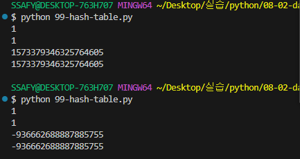

README


0729


딕셔너리 : 키와 값을 짝지어 저장하는 자료구조


내부적으로 해시 테이블을 사용하여 키-값 쌍을 관리

키를 통한 값의 삽입, 삭제, 검색이 데이터의 크기와 관계없이 매우 빠름

키는 고유 값이어야 하지만, 값은 중복이 가능하고 어떤 자료형도 저장할 수 있음


**.get(key\[,default])**

:키 연결된 값을 반환하거나 **키가 없으면 None 혹은 기본 값을 반환**


**# .keys()**


**person = {'name': 'Alice', 'age': 25}**

**print(person.keys)  # dict\_keys(\['name', 'age'])**

**person\['country'] = 'KOREA'**


**dict\_keys(\['name', 'age'])**

**: 실시간으로 동기화되는 확인 창 (view와 같은 것)**


**= 키가 삭제되거나 추가되면 반영됨**


1. 검색, 공식문서 -? 파악하고 학습
2. 대괄호가 있네? -> 리스트처럼 순회 가능한가? -> 반복...


person = {'name': 'Alice', 'age': 25}

\# print(person.keys)

person\_keys = person.keys()

person\['country'] = 'KOREA'

print(person\_keys) # dict\_keys(\['name', 'age', 'country'])

---

\#. values()


---

\# .items()

튜플 형태로 묶어서 보여줌


---

\# .pop(key\[,default])

: 키를 제거하고 연결됐던 값을 **반환** (없으면 에러나 default 반환)


\\# pop

person = {'name': 'Alice', 'age': 25}

print(person.pop('age'))  # 25

print(person)  # {'name': 'Alice'}

print(person.pop('country', None))  # None

\# print(person.pop('country'))  # KeyError: 'country'

---

\# .setdefault(key,\[,default])

:키와 연결된 값을 반환/**키가 없다면 default와 연결된 키를 딕셔너리에 "추가"하고 default를 반환**

person = {'name': 'Alice', 'age': 25}

print()  # KOREA

print(person)  # {'name': 'Alice', 'age': 25, 'country': 'KOREA'}


get 기능에 추가 기능이 붙어있다고 보면 됨


---

Q. D.clear()는 그냥 초기화하는 것과 차이가 있나요? D = {} 처럼 새로 선언하면 될 것 같은데 D.clear()를 굳이 따로 만든 이유가 뭔가 있을 것 같고...


\\#똑같은 딕셔너리 유지

D1 = {'name' : 'Alice', 'age' : 25}

D1. clear()


\\# 재할당이 이뤄진 것

D2 = {'name' : 'Alice', 'age' : 25}

D2 = {}


-> 메모리 주소 면에서 전혀 다름을 이해하기


---

\# .update (\[other])

: other가 제공하는 키/값 쌍으로 딕셔너리를 갱신하고 기존 키는 덮어씀


Q. 'age' = 100, 'address'='SEOUL' 이 아니고 age = 100, address = 'SEOUL'이 되어도 돌아가는 원리가 궁금합니다!! 문자열 Key값은 ' ' 으로 묶어주어야 하는 것 아닌가요??


문자열 = 정수 의 키를 짜는 것인가?

update는 근본적으로 함수. 함수(매개변수)를 쓸 때 함수('문자열' = 정수)를 애초에 쓸 수 없음.

매개변수(인자)에 값을 집어넣는 것이기 때문에 문법상으로 불가능


다시 공부하기


---


교재에 나오는 메서드는 반드시 다 숙지해야 하며, 빨간색은 자주 쓰므로 체화하기


---

API -> JSON("키-값") -> (실행을 위해) 변환이 필요하기에 딕셔너리로 변환하는 것.


---

>  SET


: 고유한 항목\*\*(중복 허락하지 않음)\*\*들의 **정렬되지 않은** 컬렉션


집합 연산과 해시 테이블 덕에 유사한 것 같음.

항목의 고유성을 효율적으로 보장하며 항목의 추가, 삭제, 존재 여부 확인에 데이터 크기 관계없이 매우 빠름

수학적 집합 연산을 간편하게 수행 가능


> 리스트가 세트로 형변환할 때마다 순서가 뒤섞이기에, 리스트로 다시 형변환하면 순서가 바뀐 채로만 중복 제거 가능


---

.add(x)

:세트에 x 추가 (중복이 안 되기 때문에 또 넣으면 추가 반영 안됨)


\# add

my\_set = {'a', 'b', 'c', 1, 2, 3}

my\_set.add('d')

print(my\_set)


my\_set.add('d')

print(my\_set)


.update(iterable)

:세트에 다른 iterable 요소를 추가


\# update

my\_set = {'a', 'b', 'c', 1, 2, 3}

my\_set.update(\[1, 4, 5])

print(my\_set)  # {'c', 2, 3, 1, 'b', 4, 5, 'a'}


.clear()

\# clear

my\_set = {'a', 'b', 'c', 1, 2, 3}

my\_set.clear()

print(my\_set)  # set()


.remove(x)

: 세트에서 항목 x를 제거, 항목 x가 없을 경우 keyError


\# remove

my\_set = {'a', 'b', 'c', 1, 2, 3}

my\_set.remove(2)

print(my\_set)

my\_set.remove(10)  # KeyError: 10


---

.pop()

: 세트에서 임의의 요소를 제거하고 반환

 여기서, 임의 =/= random(무작위)


---

. discard(x)

: 세트 s에서 항목 x를 제거. remove와 달리 에러 없음

기본 기능은 remove인데 set 안에 없는 키를 지웠을 때 아무런 결과가 없음


---

\#  set의 집합 메서드

set1.defference(set2) / set1-set2

intersection / set1 \& set2

issubset / set1 <= set2

issuperset / set1 >= set2

union / set1 | set2


---

\# 해시 테이블

: 키와 값을 짝지어 저장하는 자료구조 ( 표의 형태)


키를 해시 함수를 통해 해시 값으로 변환되는 것 -> 필터 혹은 분류기와 같은 느낌

변환된 해시 값을 인덱스로 삼아 데이터를 저장 혹은 찾음

이를 통해 검색, 삽입, 삭제를 매우 빠르게 수행


딕셔너리는 키를 넣으면 반드시 값이 나오게 '해시 함수'를 통해 설정되어 있기 때문에 순서대로 넣지 않아도 되는 것


해시

: 임의의 크기를 가진 데이터를 고정된 크기의 \*\*'고유한 값(정수)'\*\*으로 변환하는 것

해시 값을 이용해 해시 테이블에 데이터를 저장하며, 이 변환을 수행하는 것이 해시 함수

무조건 키를 넣으면 그 값이 나오게 해 일정한 속도를 만드는 것


해시 함수

: 해시 알고리즘이라고도 부르며, 주로 해시 테이블을 구현할 때 매우 빠른 검색 및 데이터 저장 위치 결정을 위해 활용

* 키를 입력받아 데이터를 저장하거나 찾을 배열의 \*\*'정확한 인덱스'\*\*를 즉시 계산
* 임의 길이 데이터를 입력 받아 고정 길이('정수')로 변환해주는 함수, 여기서 정수가 바로 해시 값
* 해당 위치로 곧바로 이동하여 내용을 찾음


\[ set의 요소와 해시 테이블 관계 ]


각 요소를 해시 함수로 변환해 나온 해시 값에 맞춰 해시 테이블 내부 버킷에 위치시킴

그래서 '순서'라기보다 '버킷 위치(인덱스)'가 요소의 위치를 결정

**따라서, 순서를 보장하지 않음**


\[ dict의 키와 해시 테이블 관계 ]


키 -> 해시함수 -> 해시 값 -> 해시 테이블에 저장

단 set와 달리 '삽입 순서'는 유지한다는 것이 언어 사양에 따라 보장될 뿐, 여전히 실제 (동작 원리) 순서가 보장되진 않음

키를 추가한 순서대로 반복문 순회할 때 나오게 됨

사용자에게 보여지는 키 순서는 삽입 순서가 유지되도록 설계된 것


* my\_set = {3, 2, 1, 9, 100, 4, 87, 39, 10, 52}

print(my\_set.pop())

print(my\_set.pop())

print(my\_set.pop())

print(my\_set.pop())

print(my\_set.pop())

print(my\_set.pop())

print(my\_set.pop())

print(my\_set.pop())

print(my\_set.pop())

print(my\_set.pop())

print(my\_set)


왜 모두 같은 순서로 나오는가?


해시 함수가 정수를 출력하기 때문에 정수 버킷 위치 그대로 쓰이게 되는 것.

정수(숫자) 값은 해시 값이 숫자 자기 자신과 동일하거나 단순 계산으로 고정됨


문자열 -> 해시 함수

위 상황에서 문자가 정수가 되기 위해서 변환이 이루어지며 '해시 난수화'가 이루어지게 됨.


---

파이썬에서의 해시 함수

* 정수

  - 같은 정수는 항상 같은 해시 값을 가짐


* 문자열

  -  문자열 해시의 경우, 파이썬 인터프리터 시작 대 설정되는 난수 시드(seed)가 달라질 수 있음.

  -  이 시드가 함수의 재료가 됨

  -  보안상 이유로 해시 난수화 도입
  



- 각 실행마다 난수 시드가 달라지게 되는 것
- 해시 함수의 동작이 추적될 수 있도록 하면 안됨
- 실행마다 계산에 쓰이는 시드 값이 달라져서 동일한 데이터라도 매번 해시 값이 달라져 결과적으로 버킷 배치가 달라짐
  
```
Q. 정수로만 이루어진 정보는 난수화를 거쳐도 항상 같은 값을 반환되는 거라면, 만약주민등록번호의 해시값을 알 수 있다면 원래 주민등록번호를 역추적 가능한가요?

해시 함수랑은 상관이 없고, DB 운영에서의 사용자 정보는 암호화됨.
```

---
> set의 pop( )은 '임의의 요소'를 제거하고 반환함
- 실행할 때마다 다른 요소를 얻는다는 의미에서의 '무작위(random)'가 아니라, 버킷 배치 순서가 발생한다는 개념에서 '임의'로 설명하는 것임. 그러나 배치 순서에 관여할 수 없고, 정해진 바대로는 아니기 때문에 임의의 요소가 되는 것.

> 내부적으로 해시 테이블(버킷)을 참조하기 때문에, 실행 때마다 다른 요소가 먼저 나올 수 있음
- 해시 난수화로 인해 문자열과 같은 해시 값이 실행마다 달라질 수 있고, 따라서 set 내부 요소의 배치가 달라질 수 있음
- 정수는 해시 값이 항상 동일하기 때문에 파이썬을 동일 프로세스에서 연속 실행할 때는 결과가 어느 정도 일정해 보이기도 하지만 여전히 set는 순서가 없으므로 pop되는 순서는 예측 불가

---
# hashable
- hash( ) 함수에 넣어 해시 값을 구할 수 있는 객체를 의미
- 대부분 '불변 타입'은 해시 가능
  ex. int, float, str, tuple (단, 내부에 불변만 있는 경우)
- 가변형 객체(ex. list, dict, set)는 기본적으로 해시 불가능


```
# TypeError: unhashable type: 'list'
print(hash((1, 2, [3, 4])))

# TypeError: unhashable type: 'list'
print(hash([1, 2, 3]))

# TypeError: unhashable type: 'list'
my_set = {[1, 2, 3], 1, 2, 3, 4, 5}

# TypeError: unhashable type: 'set'
my_dict = {{3, 2}: 'a'}
```

# 가변형 객체가 hashable하지 않은 이유
- 값이 변하면 해시 값도 달라질 수 있어 해시 테이블의 무결성이 깨짐 
- 해시 테이블에서는 '동일 키 -> 동일 위치'로 가정하고 빠른 검색을 수행하는데, 변하면 이 가정이 깨짐

# hashable 객체가 필요한 이유 (44슬라이드)
1. 해시 테이블 기반 자료 구조 사용
2. 불변성을 통한 일관된 해시 값
3. 안정성과 예측 가능성 유지

---
> BNF와 같은 표기법을 사용하는 이유

: 서로 다른 프로그래밍 언어, 데이터 형식, 프로토콜 등 문법을 통일하여 정의하기 위함

---
TABLE_SIZE = 1024

hash_table = [0] * TABLE_SIZE # Hash table이 주는 값만 사용 가능

# 간단한 해쉬값을 얻는 함수(실제 해쉬함수는 더 복잡)
# x:우리가 해시테이블에 저장하려는 원소(숫자로 표현)
def simple_hash(x, seed):
    # 어떤 값이든 TANLe_SIZE로 나눈 나머지는 TABLE_SIZE 보다 작음(인덱스 범위)
    return (x + seed) % TABLE_SIZE

# 이 함수의 반환값을 인덱스로 사용
# print(hash("a"))

SEED =1
x = 6
print(simple_hash(x,SEED))

# 해쉬함수의 반환값을 인덱스로 사용
idx = simple_hash(6, SEED)
hash_table[idx] = x # 해쉬함수의 결과값을 인덱스로 사용해서 x 저장

my_set = {1,2,3,"a", "b", "c"}

print(my_set.pop())

x = 101500
idx = simple_hash(x, SEED)
print(x, idx)
hash_table[idx] = x


# pop 동작 원리 (간단히)
for i in range(TABLE_SIZE):
    if hash_table[i]:
        print(f'값이 있음 : {hash_table[i]}')

for phone in data: #data 리스트를 순회하는 반복
#폰 데이터 하나에 대해 반복
	for key in key_list:
#key에 해당하는 value가 없으면 =>None 반환
#None은 False로 취급되니까 not으로 True로 바꿈
	if not phone.get(key):
#key에 해당하는 value가 없으면 value에 "unknown"이라는 문자열 할당
		phone.setdefault(key, "unknown")
	print(f"{key} 으/는 {phone[key]}입니다.")
print()