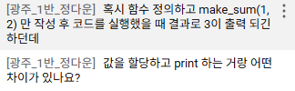

**목차**

---


함수

\- 함수 구조

\- 함수와 반환 값


매개변수와 인자

-다양한 인자 종류


재귀 함수


내장 함수


함수와 Scope

\- global 키워드


함수 스타일 가이드

\- 함수 이름 작성 규칙

\- 단일 책임 원칙


Packing\&UnPacking

\- Packing

\- Unpacking


참고

\- 함수와 반환

\- 람다 표현식


---


\# 함수

: 특정 작업을 수행하기 위한 \*\*재사용 가능한 코드 묶음\*\*


내부 코드는 숨겨져 있고, 우리는 함수 이름을 불러 특정 기능을 사용하는 것.

\* 사용 이유 : 재사용성이 높아지고, 코드의 가독성과 유지보수성 향상


두 수의 합을 구하는 코드

num1 = 5

num2 =3

sum\_result = num1 + num2


print(sum\_result)


\#그렇다면 두 수의 합을 구하는 함수가 있다면 어떤 수가 들어가도 구할 수 있지 않을까?

def get\_sum(num1, num2) :

&nbsp;      return num1 + num2


\*\*함수 호출\*\*

함수를 실행하기 위해 함수의 이름을 사용하여 해당 함수의 코드 블록을 실행하는 것


\*\*표기법\*\*

function\_name(arguments)


\#함수를 호출하여 결과 출력

num1 = 5

num2 = 3

sum\_result = get\_sum(num1, num2)

print(sum\_result)


12 슬라이드 정리해야 함 (손필기 **시험대비)


보라색은 파라미터 =  투입

하늘색은 문단 : 함수의 설명서인 Docstring (문서 문자열) \_ 선택사항

빨간색은 function body (몸통) : 들여쓰기가 되어 있음.

주황색은 return value(반환값): 이 함수의 결과


**함수 정의**


- 함수 정의는 def(ine) 키워드로 시작

- def 키워드 이후 함수 이름 작성, 뒤에 괄호가 열리고 닫힘(괄호는 없을 수도)

- 괄호 안에 매개변수 정의

- 매개변수(parameter) = 함수에 전달되는 값


**함수 바디**

- 콜론(:) 다음에 들여쓰기(띄어쓰기 4칸) 된 코드 블록 ** 콜론 잊지 말기
- 들여쓰기가 되어있는 것들은 함수 안에 속한 코드

- 함수가 실행될 때 수행되는 코드 정의


Docstring

함수 상단에 적히나, 선택적으로 작성 가능한 함수 설명서

Docstring은 보통 처음 시작하는 """에 첫줄을 이어서 씀


**함수 반환 값**

함수는 '필요한 경우' 결과를 반환할 수 있음

return 키워드 이후에 반환할 값을 명시

return  문은 ```함수의 실행을 종료```하고, 결과를 호출 부분으로 반환

함수 내에서 return 문이 없다면 None이 반환됨

함수 내에 return 문이 적혀 있지 않으면 파이썬이 자동으로 return None이 적힘

정의이기에, 완료를 return으로 표시해야 함

def my_func():
    print(1)

print(my_func())

```
실행은 호출하는 print부터 실행하나, 출력하려면 함수가 다 끝나야 호출 가능하기 때문에 그 과정에서 print(1)이 먼저 출력되는 것. return이 없으니까 아래가 나중에 출력.
```

**<함수호출>**

- 함수 사용을 위해 '호출' 필요

- 함수의 이름과 소괄호를 활용해 호출

- 필요한 경우 인자(argument)를 전달해야 함

- 전달된 인자는 함수 정의 시 작성한 매개변수에 대입됨


```
# 함수 정의

def make_sum(pram1, pram2):

   """이것은 두 수를 받아

   두 수의 합을 반환하는 함수입니다.

   >>> make_sum(1,2)

   3

   """

 # result = pram1 + pram2

   # return result

   # 위처럼도 표현 가능


   return pram1 + pram2


# 함수 호출 및 반환 값 할당 # 함수 하나가 존재한다 해서 호출했을 때 결과가 나오지 않으니 할당해야 함

sum_result = make_sum(100, 30)

print(sum_result)
```

> Q .


```
# print() 함수는 반환값이 없다.
return_value = print()
print(return_value)
```

반환값은 None
출력과 반환값은 다른 개념.
출력은 화면(터미널)에 보여주는 값일뿐, 내부적으로 아무 값도 반환하지 않는 함수와 동일.
출력을 담당하는 함수는 결과를 '반환'하지 않으므로, 내부적으로 아무 값도 반환하지 않는 함수와 동일하게 None이 나옴

파이썬에서 반환 값이 없는 함수는 기본적으로 None을 반환한다고 간주되기 때문

즉, 
return_value = print()
print(return_value) 에서
할당문은 오른쪽의 코드가 실행 (오른쪽 값 평가)하기에, print함수의 평가 결과 값이 무엇인지를 보아야 하는데, 반환값을 알아보고자 한다면 None이 평가 값으로 왼쪽으로 할당되는 것. 또한 return_value가 값을 호출하여 'None'이라는 결과가 나오게 되는 것

---
# 매개변수와 인자

**매개변수**
함수를 정의할 때, 함수가 받을 값을 나타내는 변수

**인자**
함수를 호출할 때, 실제로 전달되는 값

def add_numbers(x, y):  # x와 y는 매개변수
    result = x + y
    return result


a = 2
b = 3

sum_result = add_numbers(a, b)  # a와 b는 인자
print(sum_result)  # 5

---
인자 종류

1. 위치 인자
2. 기본 인자 값
3. 키워드 인자
4. 임의의 인자 목록
5. 임의의 키워드 인자 목록

1. 위치 인자
   - 함수 호출 시 인자의 위치에 따라 전달되는 인자
   - 위치 인자는 함수 호출 시 반드시 값을 전달해야 함

def greet(name, age):
    print(f'안녕하세요, {name}님! {age}살이시군요.')


greet('Alice', 25)  # 안녕하세요, Alice님! 25살이시군요.
greet(25, 'Alice')  # 안녕하세요, 25님! Alice살이시군요. # 반드시 위치대로 입력해야만 원하는 결과를 얻을 수 있음.
greet('Alice')  # TypeError: greet() missing 1 required positional argument: 'age'

위치 인자의 개수나 위치를 안 맞춘다면 필수적으로 위치인자인 무언가를 넣어야 하는데 누락되어 있다는 에러를 발생시킴.

2. 기본 인자 값 (Default)
   - 함수 정의에서 매개변수에 기본 값을 할당
   - 함수 호출 시 인자를 전달하지 않으면, 기본값이 매개변수에 할당딤

<Default Argument Values>
def greet(name, age=20):
    print(f'안녕하세요, {name}님! {age}살이시군요.')


greet('Bob')  # 안녕하세요, Bob님! 30살이시군요.
greet('Charlie', 40)  # 안녕하세요, Charlie님! 40살이시군요.

3. 키워드 인자
   - 함수 호출 시 인자의 이름과 함께 값을 전달
   - 매개변수와 일자를 일치시키지 않고, 특정 매개변수에 값을 할당 가능
   - 인자 순서는 중요하지 않으며, 인자의 '이름'을 명시하여 전달
   - 단, 호출 시 키워드 인자는 위치 인자 뒤에 위치해야 함


def greet(name, age):
    print(f'안녕하세요, {name}님! {age}살이시군요.')


greet(name='Dave', age=35)  # 안녕하세요, Dave님! 35살이시군요.
greet(age=35, name='Dave')  # 안녕하세요, Dave님! 35살이시군요.

greet(age=35, 'Dave')  # Positional argument cannot appear after keyword arguments
> 키워드 인자를 넣고 뒤쪽에 위치 인자를 넣는 것은 불가. 호출 시 키워드 인자는 위치 인자 뒤에 위치해야 함

>위치 인자는 정확한 순서를 알아야 하지만, 키워드 인자는 순서를 몰라도 입력하여 실행 가능. 다만 위 사항 주의할 것.

4. 임의의 인자 목록
   - 정해지지 않은 개수의 인자를 처리
   - 함수 정의 시 매개변수 앞에 '*(별표)'를 붙여 사용
   - 여러 가지 인자를 튜플로 처리 <내부 동작용>
   - 튜플 풀어내면서 활용하는 것 (결국 하나씩 꺼내 쓰는 개념)
  

5. 임의의 키워드 인자 목록
   - 정해지지 않은 개수의 키워드 인자를 처리
   - 함수 정의 시 매개변수 앞에 '**'를 붙여 사용
   - 여러 개의 인자를 딕셔너리로 묶어 처리

def print_info(**kwargs):
    print(kwargs)


print_info(name='Eve', age=30)  # {'name': 'Eve', 'age': 30}


> 함수 인자 권장 작성 순서
- 위치 ->기본 ->가변->가변 키워드

모든 상황에 적용되는 절대적 규칙은 결코 아니며, 상황에 따라 유연하게 조정될 수 있음
호출 시 인자 전달 과정에서 혼란을 줄이고자 함

def func(pos1, pos2, default_arg='default', *args, **kwargs):
    print('pos1:', pos1)
    print('pos2:', pos2)
    print('default_arg:', default_arg)
    print('args:', args)
    print('kwargs:', kwargs)


func(1, 2, 3, 4, 5, 6, key1='value1', key2='value2')
"""
pos1: 1
pos2: 2
default_arg: 3
args: (4, 5, 6)
kwargs: {'key1': 'value1', 'key2': 'value2'}
"""


defult_arg = 'default'라고 쓴 게 문자열만 받을 수 있다는 의미는 아님. 기본 인자에 타입에 정해져 있지 않음. Dogstring을 통해 함수에 대한 가이드를 쓰는 것이 정해지지 않은 이 타입을 막 쓰지 않게 만드는 장치인 것.

+ 타입을 강제하지 않았을 때, 강제할 수 있는가?
  인자 자체에서는 강제할 수 없다.
  파이썬 함수에 타입을 명시적으로 강제하지 않아도, 타입 힌트와 정적 분석 도구를 사용하여 어느 정도 타입 가이드를 할 수 있습니다. 파이썬은 기본적으로 동적 타입 언어이지만, 타입 힌트를 통해 코드의 가독성을 높이고 잠재적인 오류를 줄일 수 있습니다. 

---
# 재귀 함수
---
> 제대로 이해해야 하며, '함수'를 이해하지 못하면 함수형 프로그래밍을 할 미래에 힘들어짐. 그렇기 때문에 오늘 내용은 오늘 끝내고 넘어가야 함.

**재귀 함수 : 함수 내부에서 자기 자신을 호출하는 함수**
끝없이 호출하지 않도록 종료를 알려주어야 함.

+ 팩토리얼
  n! = n*(n-1)! = n*(n-1)*(n-2)! ...

factorial 함수는 자기 자신을 재귀적으로 호출하여 입력된 숫자 n의 팩토리얼 계산
재귀 호출은 n이 0이 될 때까지 반복되며, 종료 조건을 설정하여 재귀 호출이 멈추도록 함
그래서, n=0인지 확인하여 종료조건을 확인하는 것. 종료조건이 명확한지 확인해야 하는 것이 재귀함수의 핵심

재귀 호출의 결과를 이용하여 문제를 작은 단위 문제로 분할하고, 분할된 문제들의 결과를 조합하여 최종 결과 도

def factorial(n):
    # 종료 조건: n이 0이면 1을 반환
    if n == 0:
        return 1
    else:
        #재귀 호출:n과 n-1의 팩토리얼을 곱한 결과 반환
        return n * factorial(n-1)
    
result = factorial(5)
print(result) #120

자기 자신에게 같은 문제를 다른 input을 통해서 해결

**재귀함수 특징**
- 특정 알고리즘 식을 표현할 때 변수 사용이 줄어들며, 코드의 가독성이 높아짐
- 1개 이상의 base case(종료되는 상황)가 존재하고, 수렴하도록 작성
  
**기억해야 할 것**
- 종료 조건을 명확히 할 것 (메모리가 다른 함수보다 stack이 더 많이 쌓이기 때문)
- 재귀 함수는 메모리 사용량이 많고 느릴 수 있음
- 종료 조건이 잘못되면 스택 오버플로우 에러가 발생할 수 있어 주의해야 함
- 복잡한 재귀 함수는 오히려 코드의 가독성을 저하시킬 수 있음
- 반복되는 호출이 종료 조건을 향하도록 할 것 (수렴하게 할 것)

*수렴 : 일정한 값에 한없이 가까워지는 것.

**사용하는 이유**
- 문제의 자연스러운 표현 : 복잡한 문제를 간결하고 직관적으로 표현 가능
- 코드 간결성 : 상황에 따라 반복문보다 알고리즘 코드가 더 간결하고 명확해질 수 있음
- 수학적 문제 해결 : 수학적 정의가 재귀적으로 표현되는 경우, 직접적 구현 가능

---
# 내장 함수
: 파이썬이 기본적으로 제공하는 함수로서, 별도의  import(무언가를 포함하고자 명령) 없이 바로 사용가능한 빌트인 함수

내부 동작 원리를 이해하면 효율성, 효과성 증진 가능

예시는 41 슬라이드 참고하기 - 라이브러리 레퍼런스에 있음

파이썬 공식 문서 보면서 공부하기. 지식의 정확도 보강 가능
- 자습서랑 라이브러리 레퍼런스, 언어 레퍼런스 읽기 (버전 맞춰서)

---

# 함수와 Scope(범위)

**함수의 범위**
함수는 코드 내부에 local scope를 생성하며, 그 외 공간인 global scope로 구분

* 범위-변수 관계
  1. Scope
  - global scope : 코드 어디에서든 참조 가능한 공간
  - local scope : 함수가 만들어서, 함수 내부에서만 참조 가능한 공간
  
  2. variable(변수)
  - global variable : global scope에 정의된 변수
  - local variable : local scope에 정의된 변수

> 로컬 변수는 로컬 범위에서만 적용됨

def myfunction1():
    num1 = 10
    print(num1)

def myfunction2():
    print(num1)

myfunction1()
myfunction2()


num은 local scope에 존재하여 외부에서 사용불가하여, 변수의 수명주기가 달라지게 됨.

변수의 수명주기는 변수가 선언되는 위치와 scope에 따라 결정됨
45 슬라이드 참고

빌트인 = 파이썬 실행 이후부터 영원히 유지
글로벌 = 빌트인보다는 짧음, 모듈이 호출된 시점 이후 혹은 인터프리터가 끝날 때까지 유지
로컬 = 함수 호출 때 생성되고, 함수 종료될 때까지(만) 유지

**이름 검색 규칙**
LEGB Rule
Local->Enclosed->Global->Built-in
작은 범위에서 큰 범위로 가는 것은 되나, 반대는 안 됨

- 파이썬에서 사용되는 이름(식별자)들은 특정한 이름공간에 저장되어 있음
- 함수 내에서는 바깥 Scope의 변수에 접근 가능하나 수정은 할 수 없음


\# 내장 함수 sum의 이름을 사용해버려서 오류가 발생하는 예시
print(sum)  # <built-in function sum>
print(sum(range(3)))  # 3
sum = 5
print(sum)  # 5
print(sum(range(3)))  # TypeError: 'int' object is not callable

global space에서 int로 판단되는 5가 sum에 할당되어 버린 것.
del sum을 입력하면 복구 가능. 그러나 애초에 이런 상황이 없도록 할 

def outer_func():
    x = 'E'
    y = 'E'

    def inner_func(y):
        z = 'L'
        print(x, y, z)  # E, E, L? EPL

    inner_func('P')
    print(x, y)  # EE

위 전체가 '정의'를 가리키는 코드

50 슬라이드 보고 복습하기

---
**'global' 키워드**
- 변수의 스코프를 전역 범위로 지정하기 위해 사용
- 일반적으로 함수 내에서 전역 변수를 수정하려는 경우에 사용
  
```
num = 0  # 전역 변수


def increment():
    global num  # num를 전역 변수로 선언 #알고리즘에서 많이 보게 될 형태 #밖에 있는 num임을 지칭
    num += 1


print(num)  # 0

increment()

print(num)  # 1
```

num =10

def myfunction():
    global num
    num = 5
   
print(num) # 10

\# ‘global’ 키워드 주의사항 - 1
\# global 키워드 선언 전에 참조불가
num = 0


def increment():
    # SyntaxError: name 'num' is used # prior to global declaration
    print(num)
    global num
    num += 1

\# ‘global’ 키워드 주의사항 - 2
\# 매개변수에는 global 키워드 사용불가
num = 0


def increment(num):
    # "num" is assigned before global # declaration
    global num
    num += 1

---
# 함수 스타일 가이드

**함수 이름 작성 규칙**
- 소문자와 언더스코어(_) 사용
- ex. calculate_total_price (snake_case)
- 동사로 시작하여 함수의 동작 설명
- 약어 사용 지양

\# Good
def calculate_total_price(price, tax):
    return price + (price * tax)


\# Bad
def calc_price(p, t):
    return p + (p * t)

**함수 이름 구성 요소**
- get/set 접두사
- 동사+명사
- 동사+형용사+명사
- True/False를 반환한다면 is 또는 has 로 시작하는 것을 추천
- 이름만으로 무엇을 하는지 명확하게 표현할 것
- 프로젝트 전체에서 일관성을 지킬 것

**단일 책임 원칙**
: 모든 객체는 하나의 명확한 목적과 책임만을 가져야 함

* 함수 설계 원칙
  1. 명확한 목적
   - 함수는 한 가지 작업만 수행
   - 함수 이름으로 목적을 명확히 표현
  2. 책임 분리
   - 데이터 검증, 처리, 저장 등을 별도 함수로 분리
   - 각 함수는 독립적으로 동작 가능하도록 설계
  3. 유지보수성
   - 작은 단위의 함수로 나누어 관리
   - 코드 수정 시 영향 범위를 최소

```
# 잘못된 설계 예시 (여러 책임이 섞인 함수)
def process_user_data(user_data):
    # 책임 1: 데이터 유효성 검사
    if len(user_data['password']) < 8:
        raise ValueError('비밀번호는 8자 이상이어야 합니다')

    # 책임 2: 비밀번호 암호화 및 저장
    user_data['password'] = hash_password(user_data['password'])
    db.users.insert(user_data)

    # 책임 3: 이메일 발송
    send_email(user_data['email'], '가입을 환영합니다!')

# 올바른 설계 예시 (책임을 분리한함수들)
def validate_password(password):
    """비밀번호 유효성 검사"""
    if len(password) < 8:
        raise ValueError('비밀번호는 8자 이상이어야 합니다')


def save_user(user_data):
    """비밀번호 암호화 및 저장"""
    user_data['password'] = hash_password(user_data['password'])
    db.users.insert(user_data)


def send_welcome_email(email):
    """환영 이메일 발송"""
    send_email(email, '가입을 환영합니다!')


# 메인 함수에서 순차적으로 실행
def process_user_data(user_data):
    validate_password(user_data['password'])
    save_user(user_data)
    send_welcome_email(user_data['email'])

```

---
# Packing & UnPacking

**패킹**
: 여러 개의 데이터를 하나의 컬렉션으로 모아 담는 과정
- 여러 개의 값을 하나의 튜플로 묶는 파이썬의 기본 동작
- 한 변수에 콤마(,)로 구분된 값을 넣으면 자동으로 튜플로 처리
  
packed_values = 1, 2, 3, 4, 5
print(packed_values)  # (1, 2, 3, 4, 5)

\# ‘*’ 을 활용한 패킹 (함수 매개변수 작성 시)

def my_func(*args):
    print(args)  # (1, 2, 3, 4, 5)
    print(type(args))  # <class 'tuple'>


my_func(1, 2, 3, 4, 5)

- *를 쓰는 순간 몇 개의 인자를 스든 하나의 튜플로 만듦
- 매개변수 작성 시 남는 위치 인자들을 튜플로 묶기


\# ‘**’ 을 활용한 패킹 (함수 매개변수 작성 시)
def my_func2(**kwargs):
    print(kwargs)  # {'a': 1, 'b': 2, 'c': 3}
    print(type(kwargs))  # <class 'dict’>


my_func2(a=1, b=2, c=3)

- **를 붙인 매개변수가 남는 키워드 인자들을 모두 모아 하나의 딕셔너리로 만듦

print 함수의 패킹 예시
- 인자 개수에 상관 없이 튜플 하나로 패킹 되어서 내부에서 처리
- print(*objects,sep=' ',end='\n', file=sys.stdout, flush=False)
- 모든 비 키워드 인자는 str( )이 하듯이 문자열로 변환된 후 스트림에 쓰이는데, sep으로 구분되고 end를 뒤에 붙임
- sep > 구분선

ex.
print('hello', end=' ')
print('aaaa')

**Unpacking**
: 컬렉션에 담겨있는 데이터들을 개별 요소로 펼쳐 놓는 과정

- 튜플이나 리스트 등의 객체의 요소들을 개별 변수에 할당
- 시퀀스 언패킹 또는 다중 할당이라고 부름

\# ‘*’ 을 활용한 언패킹 (함수 인자 전달)
def my_function(x, y, z):
    print(x, y, z)


names = ['alice', 'jane', 'peter']
my_function(*names)  # alice jane peter


\# ‘**’을 활용한 언패킹 (딕셔너리 -> 함수 키워드 인자)
def my_function(x, y, z):
    print(x, y, z)


my_dict = {'x': 1, 'y': 2, 'z': 3}
my_function(**my_dict)  # 1 2 3

def my_func(x, y, z) :
    print(x,y,z)

my_dict = {'x' : 1, 'y':2, 'z': 3, 'w':4}
my_func(**my_dict)

\# TypeError: my_func() got an unexpected keyword argument 'w'

---
참고

함수의 return, 반환의 원칙
- 파이썬 함수는 언제나 단 하나의 값(객체)만 반환할 수 있음
- 목적도 하나, 값도 하나가 되도록 설계해야 함
- 여러 값을 반환하는 경우에도 하나의 튜플로 패킹하여 반환

**람다 표현식**
- 익명 함수를 만드는 데 사용되는 표현식 (특수한 상황에서만 활용)
- 한 줄로 간단한 연산이나 함수를 정의
- 함수를 매개변수로 전달하는 경우에 유용
- lambda 키워드로 선언
- map 함수와 함께 활용 (map함수의 인자로 함수가 들어가는 경우, 일회용으로 코드를 이름 없이 한 줄로 만들어 넣어주는 데에 사용)

```
# 변경 전
def addition(x, y):
    return x + y


# 변경 후
lambda x, y: x + y


# 변경 전 활용
result = addition(3, 5)
print(result)  # 8


# 변경 후 활용
addition = lambda x, y: x + y
result = addition(3, 5)
print(result)  # 8


# 람다 표현식 활용 - 1 (with map 함수)
numbers = [1, 2, 3, 4, 5]


def square(x):
    return x**2


# lambda 미사용
squared1 = list(map(square, numbers))
print(squared1)  # [1, 4, 9, 16, 25]

# lambda 사용
squared2 = list(map(lambda x: x**2, numbers))
print(squared2)  # [1, 4, 9, 16, 25]
```

99번 파일 아래 내용으로 심화하기

```

"""
람다 표현식 활용 - 2 (with sorted 함수)
sorted() 함수는 리스트를 정렬해주며, key라는 매개변수에 함수를 전달하여 
"무엇을 기준으로 정렬할지"를 지정할 수 있습니다. 
이때 간단한 기준을 제시하기 위해 lambda를 사용하는 것이 매우 효과적입니다.

예시: 학생들의 점수를 나이순으로 정렬하기
학생 데이터가 (나이, 점수) 형태의 튜플로 묶여있는 리스트가 있다고 가정해 봅시다


\# 목표: 학생들을 '나이'가 어린 순서대로 정렬하고 싶다!
"""
students = [(21, 90), (19, 95), (25, 85)]


\# 1. lambda 미사용 (일반 함수 정의)
\# 정렬의 기준(key)이 될 함수를 미리 정의
def get_age(student_data):
    # student_data는 (21, 90) 같은 튜플
    # 나이는 0번 인덱스에 있으므로, student_data[0]을 반환
    return student_data[0]


\# sorted 함수의 key 매개변수에 우리가 만든 get_age 함수를 전달
sorted_students = sorted(students, key=get_age)
print(sorted_students)  # [(19, 95), (21, 90), (25, 85)]


\# 2. lambda 사용

"""
get_age처럼 간단하고 한 번만 쓸 함수를 굳이 따로 정의할 필요 없이, lambda로 즉석에서 만들어 전달할 수 있습니다.
key=lambda student_data: student_data[0]
-> "정렬할 때 각 데이터를 student_data라고 부를게."
-> "그리고 그 데이터의 0번 인덱스 값(나이)을 기준으로 삼아줘."
"""

sorted_students = sorted(students, key=lambda student_data: student_data[0])
print(sorted_students)  # [(19, 95), (21, 90), (25, 85)]

```