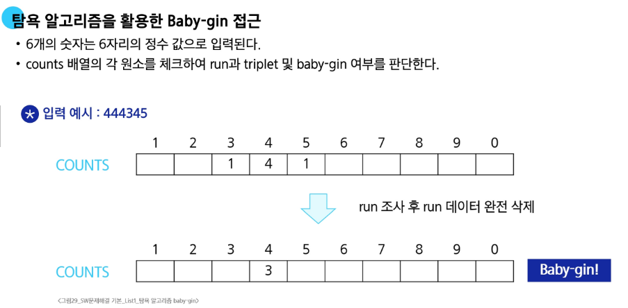

리스트2
리스트에 저장된 값 중 특정 위치인 "인덱스"의 값을 뽑아내는 데에 중점을 둠

---

**카운팅 정렬**

: 항목들의 순서를 결정하기 위해 집합에 각 항목이 몇 개씩 있는지 세는 작업을 하여, 선형 시간에 정렬하는 효율적인 방식

**제한 사항**

1. 정수나 정수로 표현할 수 있는 자료에 대해서만 적용 가능

   * 각 항목의 발생 횟수를 기록하기 위해, 정수 항목으로 인덱스 되는 카운트들의 배열을 사용하기 때문

2. 카운트들을 위한 충분한 공간을 할당하려면 집합 내 가장 큰 정수를 알아야 함

**시간 복잡도**

* O(n+k) : n은 리스트 길이, k는 정수의 최댓값 \&


57 슬라이드 이해하기.
적어도 1이 하나 존재하니까, DATA의 마지막 원소 1의 발생횟수 COUNTS\[1]을 감소시키고 최소 인덱스 3 안에는 1이 위치하기 때문에 TEMP에 인덱스 3에 1을 입력하게 되는 것. 뒤에서부터 진행한다고 생각하고, 좌표일 경우를 생각하여 위치를 고정할 수 있도록 하는 스테이블 정렬이라고도 함.

---

# 완전 검색

Baby-gin Game


완전 검색

: 문제의 해법으로 생각할 수 있는 모든 경우의 수를 나열해보고 확인하는 기법
- 모든 경우의 수를 테스트 한 후, 최종 해법을 도출하는 방법이며 일반적으로 경우의 수가 상대적으로 작을 때 유용.
- 자격검정평가 등에서 주어진 문제를 풀 때, 우선 완전 검색으로 접근하여 해답을 도출한 후, 성능 개선을 위해 다른 알고리즘을 사용하고 해답을 확인하는 것이 바람직함.

---

# 탐욕 알고리즘
: 여러 경우 중 하나를 결정해야 할 때마다 그 순간에 최적이라 생각되는 것을 선택해 나가는 방식으로 진행하여 최종적인 해답에 도달하는 방식

- 최적해를 구하는 데 사용되는 근시안적 방법
- 각 선택 시점에서 이루어지는 결정은 지역적으로는 최적이지만. 그 선택들을 계속 수집하여 최종적인 해답을 만들었다고 하여 그것이 최적이라는 보장은 없음
- 일반적으로 머리에 떠오르는 생각을 검증 없이 바로 구현하면 Greedy 접근.

** 과정 **
```
1. 해 선택 : 현재 상태에서 부분 문제의  최적 해를 구한 뒤, 이를 부분 해 집합에 추가
2. 실행 가능성 검사 : 새로운 부분 해 집합이 실행 가능한지를 확인. 즉 문제의 제약 조건을 위반하지 않는지 검사
3. 해 검사 : 새로운 부분 해 집합이 문제의 해가 되는지를 확인. 아직 전체 문제의 해가 완성되지 않았다면 1의 해 선택부터 다시 시작.
```




자릿수를 늘려서 메모리를 많이 쓰는 대신 연산을 줄이는 '패딩'

