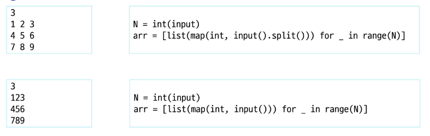
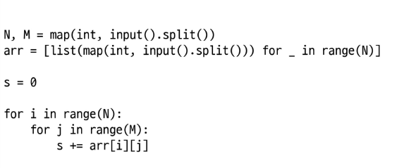
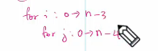
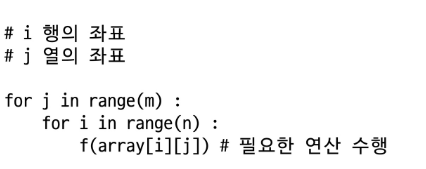
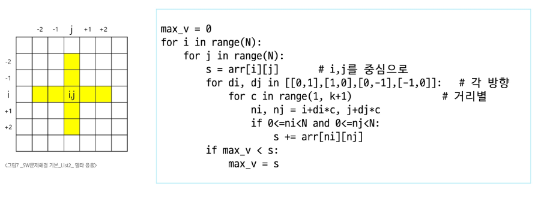
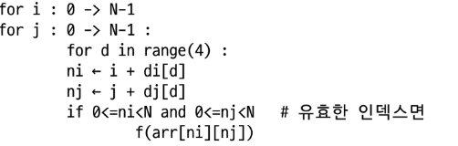
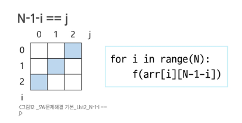
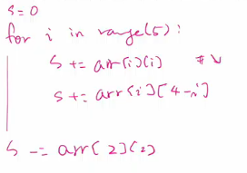

#**2차원 리스트**

**2차원 배열**

- 1차원 리스트를 묶어놓은 리스트
- 2차원 이상의 다차원 리스트는 차원에 따라 인덱스를 선언
- 2차원 리스트의 선언 : 세로길이(행의 개수), 가로길이(열의 개수)를 필요로 함
- 예를 들어, arr[0][1]은 0행의 1열 인덱스로 추출한 수를 말함
- 흔히 행은 i로 접근, 열은 j로 접근
- 파이썬에서는 데이터 초기화를 통해 변수 선언과 초기화가 가능
  - arr = [[0]*M for _ in range(N)]처럼 초기값을 주면 바로 2차원 배열 생성 가능
  - 별도의 int, array, new 키워드 없이 간결하게 선언과 초기화가 동시에 됨

[예시]


리스트 컴프리에이션 활용해서 입력을 N번 받아 2차원 리스트로 만들기
```
matrix = [list(map(int, input().split())) for _ in range(N)]
```

+ print(*matrix) 에서 *은 언패킹 인자로서 풀어내서 출력함을 알기

> 띄어쓰기 유무 신경써서 구분해서 만들기

> 형태 외우기

* 0으로 채워진 3*4 배열 만들기 _ 카운트 배열 만드는 데에서 배움

    arr = [[0] * 4 for _ in range(3)]


+ '_'는 변수명으로 이용하되, 별 의미 없이 실행할 때 사용
---
```
N,M = map(int,input().split())
```
여기서 N은 세로, M은 가로
```
matrix = matrix = [list(map(int, input().split())) for _ in range(N)]
```
range는 세로인 N 기준으로 들어가야 함

---
**배열 순회**

: n×m 배열의 n×m개의 모든 원소를 빠짐없이 조사하는 방법

* 행 우선 순회
  
  \#  i 행의 좌표

  \#  j 열의 좌표

  다만, x, y는 행과 열 표현 변수로 쓰지 않을 것을 추천
  패딩을 만드는 카운팅 정렬과 달리, 더미를 만들지 말고 딱 떨어지게 하는 것이 좋음. 
  부분배열 M의 길이가 3이라고 할 때 마지막 순회하는 건 N-M까지 이루어짐

a-1
```
  array = [
  [A, B, C, D],   ← 0번째 행
  [E, F, G, H],   ← 1번째 행
  [I, J, K, L]    ← 2번째 행
]

0번째 행 → A → B → C → D
1번째 행 → E → F → G → H
2번째 행 → I → J → K → L

A → B → C → D → E → F → G → H → I → J → K → L

```
a-2
```
  MAX_v =0
  for i in range(n):
    for j in range(m):
      f(array[i][j]) # 필요한 연산 수행
```

[a-1 보완본]


N * M 배열의 크기와 저장된 값이 주어질 때 합을 구하는 법

i와 j를 기준점으로 잡아서 코드 짜는 법 (부분배열의 기준 원소 i, j)



[슈도코드]
```
for p: 0 -> 2
  for q: 0 -> 3
    arr[i+p][j+q]
```
[파이썬 코드]

```
for p in range(0, 3):     # p: 0, 1, 2
    for q in range(0, 4): # q: 0, 1, 2, 3
        arr[i + p][j + q]
```
arr[i + p][j + q]는 2차원 배열 arr에서 (i+p, j+q) 위치에 있는 값을 의미

즉, 기준점 (i, j)에서 오른쪽으로 3칸, 아래로 2칸 총 3행 4열짜리 영역을 순회한다는 의미

---

정렬할 때 고정하는 걸 코드에서 제일 바깥으로 뺌


**지그재그 순회**

: 원리 이해해두기

---

# 델타 

: 2차원 배열 탐색, 2차 배열의 한 좌표에서 4방형태의 인접 배열 요소를 탐색

- *IM 통과에 필수개념
- 대각선으로 접근해야 하는 경우도 존재하며 상하좌우 네 방향, 혹은 여덟 방향 전부를 원소에 접근하여 연산하기도 함.
- 인덱스(i, j)인 칸의 상하좌우 칸 (ni, nj), 즉 N * N 배열에서 각 원소를 중심으로, 상하좌우 k칸의 합계 중 최대값(k = 2)



오른쪽 칸 예시를 봤을 때, (i,j) 기준으로 인덱스 변화가 이루어지는 방식을 이해 가능

**개념정리**

* 델타란?

  **델타(delta)**
  는 그리스어로 ‘차이(Δ)’를 의미하며, 2차원 배열에서는 특정 좌표 (i, j)에서 인접한 방향으로 이동할 때의 **변화량(차이)**
  을 델타라고 부름

  즉 인덱스 연산이라고 이해하면 됨

```
# 현재 위치
i, j = 2, 3

# 4방향 탐색
for d in range(4):
    ni = i + di[d]  # 새로운 행
    nj = j + dj[d]  # 새로운 열
    
    # 배열 범위 안에 있는지 확인
    if 0 <= ni < N and 0 <= nj < M:
        print(f"이동한 위치: ({ni}, {nj}) → 값: {array[ni][nj]}")
```
| 방향     | 행 변화 | 열 변화 |
| ------ | ---- | ---- |
| ↑      | -1   | 0    |
| ↓      | +1   | 0    |
| ←      | 0    | -1   |
| →      | 0    | +1   |
| ↖ (좌상) | -1   | -1   |
| ↗ (우상) | -1   | +1   |
| ↙ (좌하) | +1   | -1   |
| ↘ (우하) | +1   | +1   |



위 내용이 세트임을 알고 익히기

슈도코드에서는 if에 콜론 없는 거 신경 쓰지 말기 (if문은 유효한 인덱스인지 확인하는 것)

🔹 di, dj 선언 위치

"di, dj를 바깥에 만들어 놓고 for문을 써도 되고, for문에서 직접 만들어서 써도 된다"
```
di = [-1, 1, 0, 0]
dj = [0, 0, -1, 1]

for d in range(4):
    ni = i + di[d]
    nj = j + dj[d]
```
```
for di, dj in [(-1,0), (1,0), (0,-1), (0,1)]:
    ni = i + di
    nj = j + dj
```
취향에 맞게 활용하는 연습하기. 그 대신 for문 자체에서 만들면 범위보다는 바로 값으로 적용하게 됨.
다양한 방법을 알고 있으면서 다른 코드를 볼 때 인지하기

+ N*N 배열에서 각 원소를 중심으로, 상하좌우 k칸의 합계 중 최대값 (k=2) 문제
여기서 if문은 경계를 벗어난 값을 버리는 역할을 하게 됨
```
max_v = 0
for i in range(N):         # 모든 행
    for j in range(N):     # 모든 열
        s = arr[i][j]      # 중심점 값 (i, j)
for di, dj in [[0,1],[1,0],[0,-1],[-1,0]]:  # → ↓ ← ↑

for c in range(1, k+1):
    ni, nj = i + di*c, j + dj*c
    if 0<=ni<N and 0<=nj<N:
        s += arr[ni][nj]
```
> 여기서 '*'은 벡터나 위치 계산에서 거리와 방향을 곱할 때 쓰이는 기호로서,  di 방향으로 c만큼 이동이라는 뜻을 가짐
```
if max_v < s:
    max_v = s
```

---

**전치 행렬**

<기초>
```
arr = [
    [1, 2, 3],
    [4, 5, 6]
]

for i in range(len(arr)):        # 2개의 행: 0, 1
    for j in range(len(arr[0])): # 3개의 열: 0, 1, 2
        print(f'arr[{i}][{j}] = {arr[i][j]}')
```
arr: 전체 2차원 리스트 (행의 집합)

arr[i]: i번째 행

arr[i][j]: i행 j열의 원소

len(arr): 행의 개수 (세로 줄 수)

len(arr[0]): 열의 개수 (가로 칸 수)

i :	행 번호 (세로 줄 번호)

j	: 열 번호 (가로 칸 번호)

<설명>

전치행렬은 arr[i][j]와 arr[j][i]를 교환하면 만들어질 수 있음

단, 모든 원소를 다 바꾸면 같은 위치를 두 번 바꿀 수 있으니 i < j일 때만 교환

예: (0,1)과 (1,0)만 바꾼 뒤 (1,0)을 또 바꿀 필요 없음
```
for i in range(3):
    for j in range(i):
        arr[i][j], arr[j][i] = arr[j][i], arr[i][j]
```
**만약 내부 반복문을 for j in range(i):로 한다면:**

j는 항상 i보다 작은 값이므로 if i < j: 조건이 필요 없어짐

---

* i,j의 크기에 따라 접근하는 원소 비교(N×N)



* 고정된 값 N에서 빼주는 것이자 증가하는 애를 이용해서 감소하는 애를 구하는 것.

> N-1은 고정된 상수고, i가 증가함에 따라 j = N-1-i는 자동으로 감소함

* 좌하향 혹은 우상향 인덱스 이동

> i == j면 좌상 → 우하(↘) 방향 대각선

> i + j == N - 1이면 좌하 → 우상(↗) 방향 대각선


* 대각선 원소의 특징은 보통 i,j가 같기 때문에 단일 for문을 활용하면 됨
> i == j인 경우, 하나의 i만 써도 arr[i][i]로 접근 가능하니까 for문 하나로 충분함.

> i + j == N-1도 마찬가지로, j를 N-1-i로 바꾸면 역시 단일 for문으로 해결 가능

**[연습문제]**



-> 중심원소가 중복되므로 한 번은 빼줘야 함.

S-= arr[2][2]


