# 부분집합

- 완전검색 기법으로 부분집합 합 문제 풀기
- 우선 집합의 모든 **'부분집합을 생성'** 한 후에 각 부분집합의 합을 계산
- 주어진 집합의 부분집합을 생성하는 **'방법'** 생각해보기

 
> **[부분집합의 개수]**

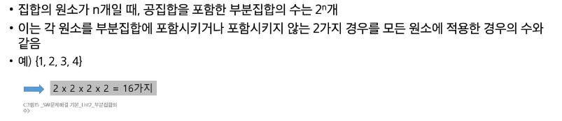

> **[부분집합의 원소를 표현하는 방법]**

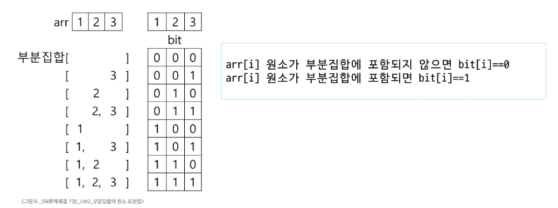

```
* bit[i] = 0 : arr[i] 원소가 부분집합에 포함 X
* bit[i] = 1 : arr[i] 원소가 부분집합에 포함 O
```
---

> **[각 원소가 부분집합에 포함되는지 loop를 통해 확인하고 부분집합 생성하는 방법]**

```
bit = [0,0,0,0]
for i in range(2) :
  bit[0] = i              # 0번 원소
  for j in range(2) :
    bit[1] = j            # 1번 원소
    for k in range(2) :
      bit[2] = k          # 2번 원소
      for l in range(2) :
        bit[3] = l        # 3번 원소
        print_subset(bit)    # 생성된 부분집합 출력
```
---
> **비트 연산자**

> bool 연산자와 유사

-  & : 비트 단위로 AND 연산
-  | : 비트 단위로 OR 연산
- << (left shift): 피연산자의 비트 열을 왼쪽으로 이동
- \>> (right shift): 피연산자의 비트 열을 오른쪽으로 이동 

> **<< 연산자 활용**
- **1<<n** : 2의 n 제곱
- 즉, 원소가 n 개일 경우의 모든 부분집합의 수를 의미
  
> **& 연산자 활용**
- **i & (1<<j)** : i의 j번째 비트가 1인지 아닌지를 검사

---

> 비트 연산으로 부분집합을 생성하는 방법

```
arr = [3,6,7,1,5,4] # 집합

n = len(arr)    # n : 원소의 개수

for i in range(1<<n) : # 1<<n : 부분집합의 개수(2를 n번 곱했다=2진수 인덱스를 옮김)
   for j in range(n) : # 원소의 수만큼 비트 비교
       if i & (1<<j) : # i의 j번 비트가 1인 경우
           print(arr[j], end=",") #j번 원소 출력
   print()
print()
```
* 다시 보기
```
arr = [3,6,7,1,5,4]

n = len(arr)    # n : 원소의 개수

for i in range(1<<n) : # 1<<n : 부분집합의 개수
   for j in range(n) : # 원소의 수만큼 비트 비교
       if i & (1<<j) : # i의 j번 비트가 1인 경우
           print(arr[j], end=",") #j번 원소 출력
   print(f' : {i:06b}')
print()
```

---
# 검색과 정렬

# 검색
- 저장되어 있는 자료 중에서 원하는 항목을 찾는 작업
- 목적하는 탐색 키를 가진 항목을 찾는 것

* 탐색 키

# 순차 검색 
* 일렬로 되어 있는 자료(선형 자료 구조)를 순서대로 검색 (파이썬에서의 in)
  - 배열이나 연결 리스트 등 순차구조로 구현딘 자료구조에서 원하는 항목을 찾을 때 유용
  - 검색 대상 수가 많은 경우 수행시간이 급격히 증가해 비효율적
  
* 정렬 여부에 따라
  - 순차 검색 대상이 정렬되어 있지 않은 경우(C1)와 정렬되어 있는 경우(C2)로 구분


**C1**
* 검색 과정
  1. 첫 번째 원소부터 순서대로 검색 대상과 키 값이 같은 원소가 있는지 비교하며 찾기
  2. 키 값이 동일한 원소를 찾으면 그 원소의 인덱스를 반환
  3. 자료구조의 마지막에 이를 때까지 검색 대상을 찾지 못하면 검색 실패
---
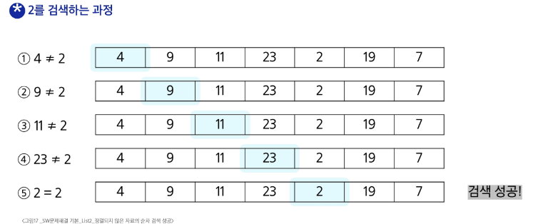
---
```
- key[2]를 찾는다면,

def my.search(key):
for i in range(N)

으로 접근해서 하나하나 찾는 과정을 거침

- 찾으면 검색 성공!으로 return i를 하게 됨
```
> **검색 실패의 경우에 앞선 검색 성공과 같이 하나하나 찾아 검색 결과를 도출하고 끝까지 가고서야 검색 실패임을 알게 되는 방식**

**[구현 예시]**
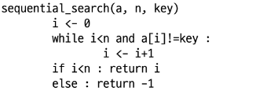

> 슈도 코드를 파이썬으로 옮겨 보기

- 찾고자 하는 원소의 순서에 따라 비교 횟수가 결정됨
- 정렬되지 않은 자료에서의 순차 검색 성공 시 평균 비교 횟수
  = (n+1)/2
- 검색 실패 시 마지막 원소가지 비교해야 하므로 평균 비교 횟수는 n이 됨
- 시간 복잡도 : O(n)

---
**C2**

* 검색 과정

1. 자료가 오름차순으로 정렬된 상태에서 검색을 실시
2. 자료를 순차적으로 검색하면서 키 값을 비교하여, 원소의 키 값이 검색 대상의 키 값보다 크면 찾는 원소가 없다는 것이므로 더 이상 검색하지 않고 검색을 종료

찾고자 하는 원소의 순서에 따라 비교횟수가 결정
- 정렬이 되어 있으므로, 검색 실패를 반환하는 경우에도 평균 비교횟수는 반으로 줄어듦
  = (n+1)/2
- 시간 복잡도 : O(n)

**[구현 예시]**
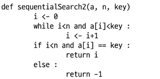

> 슈도 코드 파이썬 코드로 옮기기

---
# 이진 검색

- 자료의 가운데에 있는 항목의 키 값과 비교하여 다음 검색의 위치를 결정하고 검색을 계속 진행하는 방법
- 목적 키를 찾을 때까지 이진 검색을 순환적으로 반복 수행함으로써 검색 범위를 반으로 줄여가면서 보다 빠르게 검색을 수행
- 이진 검색을 하기 위해서는 자료가 정렬된 상태여야 함
---


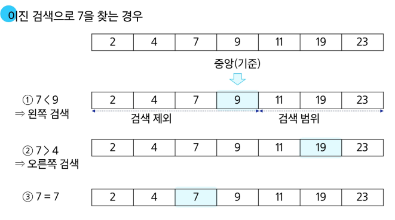
> (1)의 검색 제외와 검색 범위 반대로 작성되어 있음

* **검색 과정**
  1. 자료의 중앙에 있는 원소 고르기
  2. 중앙 원소 값과 찾고자 하는 목표 값을 비교
  3. 목표 값이 중앙 원소의 값이 작으면 자료의 왼쪽 반에 대해서 새로 검색을 수행, 크면 자료의 오른쪽 반에 대해서 새로 검색을 수행
  4. 찾고자 하는 값을 찾을 때까지 1~3 반복 

[구현]
- 검색 범위의 시작점과 종료점을 이용하여 검색 반복 수행
- 자료에 삽입이나 삭제가 발생하면 배열의 상태를 항상 정렬 상태로 유지하는 추가 작업이 필요한 **'이진 검색'**

> **이진 검색 알고리즘 구현**

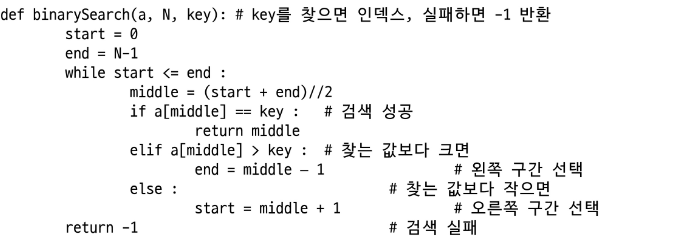
 여기서 middle이 가운데 값이기에 middle은 기준점으로서 작용하는 것으로 보임. 그러니까 middle은 제외해야 함.

 > while start <= end: 유효한 범위에서 이루어짐
 
 

 >기본적 배열에서의 이진 탐색(검색) 알고리즘이라고 할 수 있음

 > 재귀함수를 이용해서 만드는 방법도 있음

 ---
 > 인덱스
 - 원본 데이터 배열과 별개로, 배열 인덱스를 추가
 - 원본 데이터에 데이터가 삽입될 경우 상대적으로 크기가 작은 인덱스 배열을 정렬해서 속도가 빠름
  
> 데이터베이스 인데스는 이진 탐색 트리 구조로 되어있음

---
# 선택 정렬
: 주어진 자료들 중 가장 작은 값의 원소부터 차례대로 선택하여 위치를 교환하는 방식(오름차순의 경우)

**[시간 복잡도]**

O(n의 2제곱)

**[정렬 과정]**

- 주어진 리스트 중에서 최솟값을 찾기
- 그 값을 리스트의 맨 앞에 위치한 값과 교환 (인덱스 위치 교환)
- 맨 처음 위치를 제외한 나머지 리스트를 대상으로 위 과정 반복

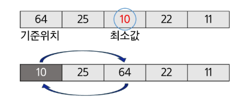

**[진회색은 정렬된 원소/연회색은 미정렬 원소]**

> 버블 정렬은 끝부터 이동, 선택 정렬은 최솟값이 이동

> **미정렬 원소가 하나 남은 상황에서는 마지막 원소가 가장 큰 값을 갖게 되므로, 실행을 종료하고 선택 정렬 완료됨**

**[알고리즘 구현]**

[슈도코드]
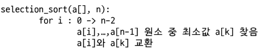

[파이썬 코드]
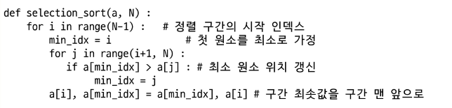
```
- 비교하는 구간을 j로 설정
- 위치 갱신을 먼저 하고, 실질적 구간 최솟값을 구간 맨 앞으로
```
> 버블과 선택을 비교해서 학습을 해야 함 : 버블 정렬은 끝이 점점 줄어들고, 선택 정렬은 시작을 i로 해서 두 개가 남을 때까지 앞부분이 뒤로 가는 것.

**Q. 버블 정렬은 크기 비교 시 결과에 따라 자리가 바뀌고 선택 정렬은 index만 저장해두고 Path 마지막에 바뀌나요?**

A. 네. 마지막에 바뀝니다.

---
# 셀렉션 알고리즘

: 저장되어 있는 자료로부터 k번째로 큰 혹은 작은 원소를 찾는 방법을 셀렉션 알고리즘이라 함
- 최솟값, 최댓값, 혹은 중간값을 찾는 알고리즘을 의미

[선택 과정]
- 정렬 알고리즘을 이용해 자료 정렬
- 원하는 순서에 있는 원소 가져오기
---
> 다시 제대로 개념 잡기

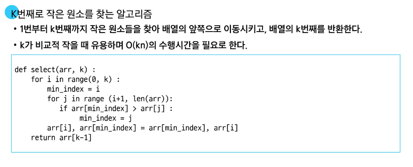
---

