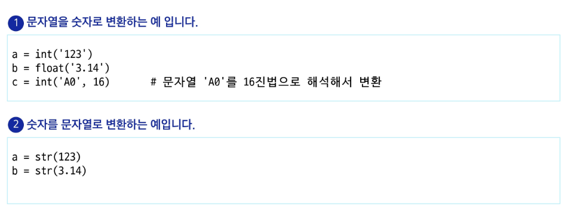
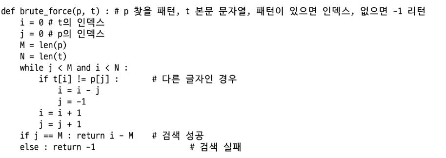

# 연산

reverse는 메서드
reversed는 함수

위는 슬라이싱으로 복제본 만드는 거
아래는 직접 뒤집는 가변형 데이터인 거

**join 개념 다시 익히기

직접 타이핑 해서 알아보기
---
> 회문

---

---
# 패턴매칭

> 고지식한 알고리즘
- 반드시 할 수 있어야 함
- 이중 for문으로의 구현이라도 할 수 있어야 함

* 효율적 방법(개요는 알기)

> LPS 배열(알고리즘) 
- 효율적인 패턴 매칭 방법

> 불일치 문자 휴리스틱

> skip 배열
- 현재 불일치 난 곳으로부터 몇 개 떨어져 있는지를 표현?
- 아스키 값을 인덱스로 하여 접근하도록 함

# 문자열 매치 알고리즘 비교
: 참고로 알아두고 그래도 고지식한 패턴 검색 등을 이제까지 배운 검색 알고리즘으로 풀어볼 수 있도록 해보기

# 문자열 압축

---

위 코드를 하나하나 분석해서 이해할 수 있도록 하기

