# Stack

index
1. Stack 자료구조 이해
   - 개념과 특성
   - 기본 연산
   - 구현 실습
2. 응용
   - 괄호 검사
   - Function Call
    
---

#스택
: 물건을 쌓아 올리듯 자료를 쌓아 올린 형태의 자료구조
- 대표적인 선형 자료구조 중 하나로 자료를 삽입하거나, 자료를 꺼내는 작업을 수행 가능
- 무조건 기준은 후입선출(LIFO:Last-In-First-Out), 즉 가장 마지막에 넣은 자료가 가장 먼저 나오는 것

---

> 기본 연산

- 배열을 통해 구현할 수 있음 : 파이썬에서는 리스트를 사용해 구현 가능
- 저장소 자체를 스택이라 부르기도 함
- 스택에서 마지막 삽입된 원소의 위치는 스택 포인터, **top**으로 부르며 데이터를 넣거나 뺄 때 기준이 됨
- 'top'이 모든 기준

> 스택의 연산
1. 삽입(Push)
: 저장소에 자료를 저장하는 연산
   
2. 삭제(Pop) _  파이썬의 기본 문법 속 pop과는 다름
: 저장소에서 삽입한 자료의 역순으로 꺼내는 연산, 해당하는 데이터를 반환하고 스택에서는 그 데이터가 사라짐
   
3. 스택이 공백인지 아닌지를 확인하는 연산(isEmpty)
: 스택이 비어 있으면 True, 아니면 False를 반환
   
4. 스택의 top에 있는 item(원소)을 반환하는 연산(peek)
: 반환은 하지만, 삭제하지 않음
   
---

* **top = 마지막 저장 위치**

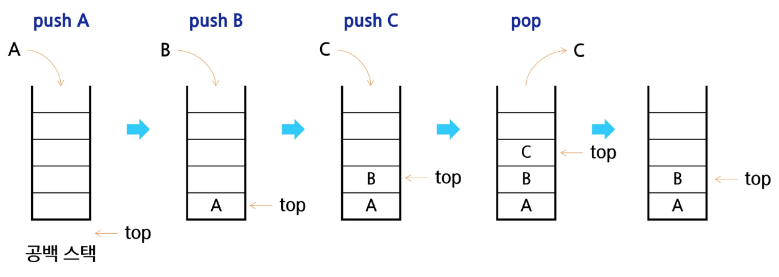

빈 스택에 원소 A, B, C를 차례로 삽입해서 탑을 거기를 가리키게 해라?

- top을 하나 증가시키고 거기에 A를 집어넣는다는 개념이 맞음

- 그렇게 빈 스택에 탑을 증가시켜서 데이터를 차례로 넣음

- 그 이후 pop으로는 탑을 하나 줄이면서 그 속 데이터를 꺼내오게 됨

- 그래서 역순으로 꺼내게 되는 것

-> 리스트로 어떻게 구현할 수 있을지 생각해보기

---
> Push 연산

- append 메소드로 리스트 마지막에 데이터 삽입
: 느리지만 하나하나 넣는다는 개념으로 구현 시도 가능
  
- 인덱스 연산을 활용한 구현

* 상황 설정
stack = [0] * 10 # 크기가 정해져있는 stack 쓰는 거 아직은 연습해서 익혀야 할 단계
top = -1
``` 
def my_push(item, size):
    global top 
    top += 1
    if top==size:           # 디버깅 용도의 코드 (try-except 구조를 쓰지 않기 위한 장치)
        print('overflow!')
    else:
    stack[top] = item
```

Q. 삽입, 삭제를 할때만 top이 필요한가요?

A. 공백인지 확인할 때, 가장 위에 있는 원소를 확인할 때도 필요

---

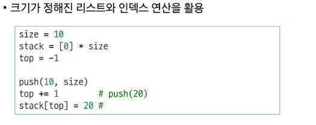

push(10,size) # 격식을 갖추면
top += 1         # push(20)
stack[top] = 20  #

---
> **Pop 연산**

    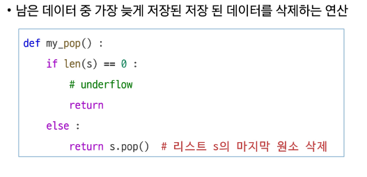
: 효율적이진 않다

주석(#) underflow => print('underflow')

return s.pop() # 리스트 s의 마지막 원소 삭제

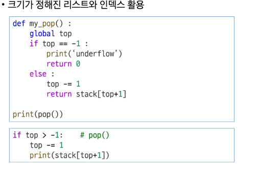

## 📌 스택 구현 개념 정리

### 1. `top == -1` 의미
- **스택이 비었다**는 뜻  
- `top` : 현재 스택의 마지막 원소 인덱스  
- 초기값 : **-1** (유효한 원소 없음)
- **이유**
  - push/pop 로직을 단순화  
  - 빈 상태를 한 줄 조건(`top == -1`)으로 쉽게 판별 가능

---

### 2. `return stack[top+1]` 의미
- 일반적인 pop 절차:
  1. 값 읽기 → `data = stack[top]`
  2. `top -= 1`
  3. 값 반환 → `return data`
- `stack[top+1]`을 쓰는 경우:
  - **`top`을 먼저 줄이고** → `top -= 1`
  - 그 다음 직전 위치 값 반환 → `return stack[top+1]`
  - → **"pop 직전 top 위치의 값"**을 참조하는 방식

---

### 3. pop 후 push 시 동작
- pop은 메모리에서 값을 삭제하지 않음 → **top 인덱스만 감소**
- push 시 top 증가 → **그 자리에 새 값 덮어쓰기**
- **결과** : "삭제 후 추가"처럼 동작 (실제로는 **덮어쓰기**)

---

### 4. 정리 예시 (배열 크기 5, push/pop 시 top 변화)

| 동작   | top 값 변화 | 의미                       |
|--------|------------|---------------------------|
| 초기   | -1         | 빈 스택                    |
| push A | 0          | `stack[0] = 'A'`           |
| push B | 1          | `stack[1] = 'B'`           |
| pop    | 0          | 'B' 무시, top 0로 이동     |
| push C | 1          | `stack[1]` 자리에 'C' 저장 |

---

pop은 주로 while 안에서 많이 나오게 될 것.
stack이 어떤 상태인지 보고 싶으면 "while stack:"으로 보면 됨

> 스택 구현 고려사항

- 1차원 배열을 사용하여 구현할 경우,
장) 구현이 용이 
단) 스택 크기 변경 어려움

> **구현 연습**
---
```
stack = []
stack.append(1)
stack.append(2)
stack.append(3)

print(stack.pop())
print(stack.pop())
print(stack.pop())
```


---
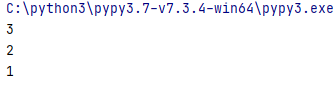

---

```
top = -1
stack = [0] * 10

top += 1 #push(1)
stack[top] = 1
top += 1 #push(1)
stack[top] = 2
top += 1 #push(1)
stack[top] = 3

top -= 1 #pop()
print(stack[top+1])
top -= 1 #pop()
print(stack[top+1])
top -= 1 #pop()
print(stack[top+1])
```
---
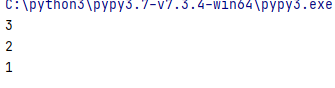

---
# 괄호 검사

> **괄호의 종류**

* 대괄호'[ ]'
* 중괄호'{ }'
* 소괄호'( )'

> 조건
```
1. 왼쪽 괄호의 개수와 오른쪽 괄호 개수가 같아야 함 (짝이니까)
2. 같은 괄호에서 왼쪽 괄호는 오른쪽 괄호보다 먼저 나와야 함
3. 괄호 사이에는 포함관계만 존재
```

> 스택을 이용한 괄호 검사
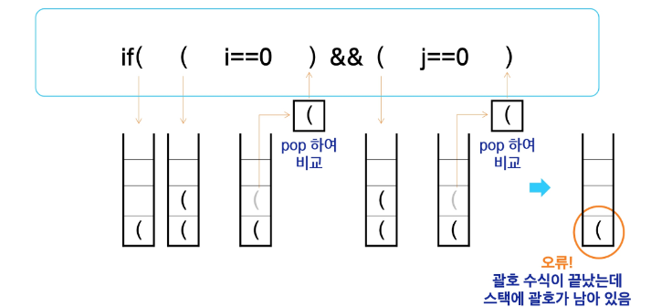

- 여는 괄호는 push(스택에는 무조건 여는 괄호만 넣어)
- 대응되는 닫는 괄호를 스택에서 찾아서 pop하고 비교
- 괄호 1,2,3,4,5 에서 짝을 맞춰보고
- 스택에 검사 후 여는 괄호가 남아있다면 처음에 주어진 괄호는 잘못되어 오류임을 나타내게 됨
- 오류 판명
- 닫힌 괄호 수가 더 많으면 언더플로우 발생

> 괄호 검사 알고리즘 개요

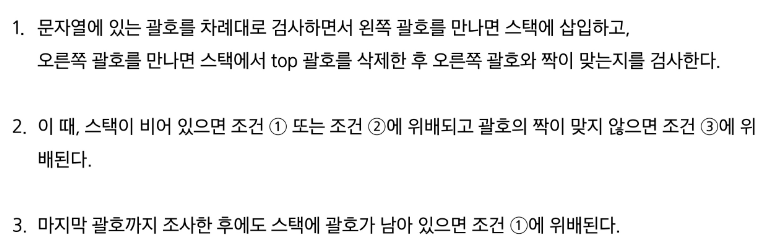

- 위배되면 오류 발생함

---
> **연습문제 2**

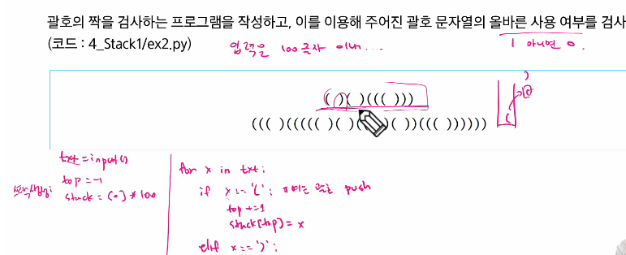

- **하나라도 오류가 있다면 기록하고 중단**

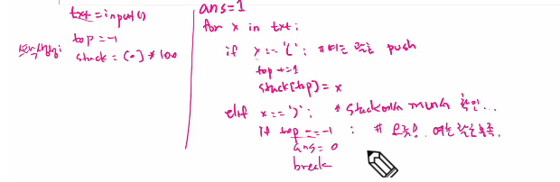

else:
top -= 1 # pop 실행
[ 짝인가?? ] # 짝 확인

* **무조건 짝인 상황이라면 입력받고 버리면 됨**

> **정상(적) 종류인 경우에도** # 혹시 남아 있는 게 있는가? 스택에 남은 게 있으면 오류!
```
if top != -1:
  ans = 0
print(ans)
```

---
# Function Call
: 프로그램에서의 함수 호출과 복귀에 따른 수행 순서 관리
- 가장 먼저 호출된 함수가 가장 먼저 실행을 완료하고 복귀하는 후입선출 구조이므로, 후입선출 구조의 스택을 이용하여 수행순서 관리
- 들여쓰기 없이 시작하는 부분이 main()이라고 생각하면 됨

> **시스템 스택**
 - 함수 수행에 필요한 지역변수, 매개변수 및 수행 후 복귀할 주소 등의 정보를 저장함
 - 함수 호출이 발생하면 스택 프레임에 저장하여 시스템 스택에 삽입
---
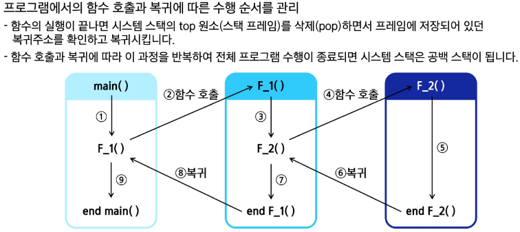

---
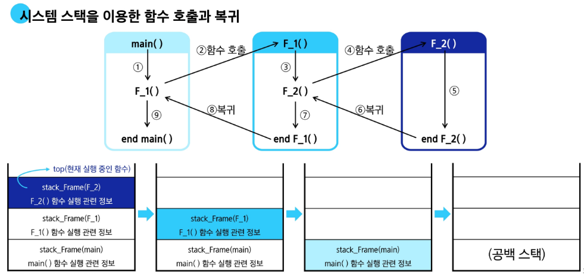

---