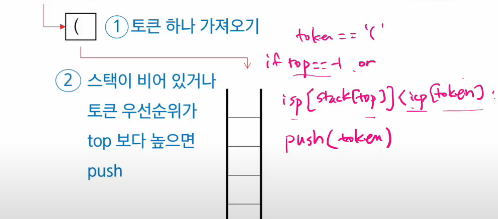
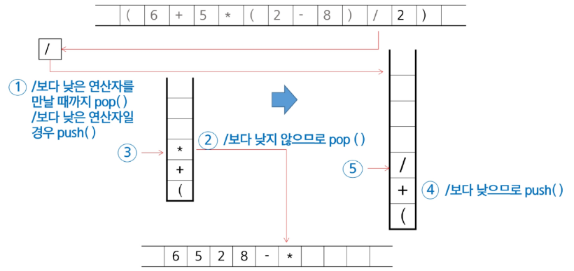
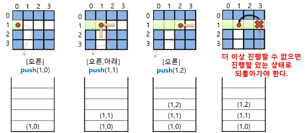
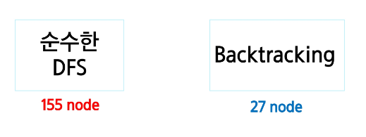

# 스택 계산기
## <후위 표기법 변환>

### 문자열로 된 계산식

- Stack을 이용하여 값을 계산
- 문자열 수식 계산의 일반적인 방법
 * 중위 표기법의 수식을 후위 표기법으로 변경(스택 이용)
 * 후위 표기법의 수식을 스택을 이용하여 계산
```
 * 중위 표기법 : 연산자를 피연산자의 가운데 표기하는 방법
ex. A+B

* 후위 표기법 : 연산자를 피연산자 뒤에 표기하는 방법
ex. AB+
```
* Step 1. 중위 표기법의 후위 표기법 변환 방법 1
1. 수식의 각 연산자에 대해서 우선순위에 따라 괄호를 사용하여 다시 표현
2. 각 연산자를 그에 대응하는 오른쪽 괄호의 뒤로 이동시킴
3. 괄호 제거

* Step 1. 중위 표기법의 후위 표기법 변환 방법 2
1. 입력 받은 중위 표기법에서 "토큰"을 읽는다
2. 토큰이 피연산자면 토큰을 출력한다
3. 토큰이 연산자(괄호포함)일 때,
  - 이 토큰이 스택의 top에 저장되어 있는 연산자보다 "우선순위"가 높으면 스택에 push하고
  - 그렇지 않다면 스택 top의 연산자의 우선순위가 토큰의 우선순위보다 작을 때까지 스택에서 pop한 후 연산자를 push한다
  - 만약 top에 연산자가 없으면 push한다




17슬라이드

## 📌 후위 표기법 변환(Postfix Notation) 절차

**서술형 나오기 좋음

### 1. 연산자 우선순위 처리
- 토큰(연산자)의 **우선순위가 높은 것**을 **스택의 top**에 올린다.
- 같은 과정을 반복한다.
- **피연산자(숫자, 변수)** 는 바로 **결과(출력)** 에 추가한다.

### 2. 닫는 괄호 처리
- 괄호를 우선순위를 높여주는 연산자의 일종처럼 생각한다.
- 닫는 괄호 `)`를 만나면,  
  **여는 괄호 `(`가 나올 때까지** 스택에서 `pop`한다.
- 꺼낸 값이 **연산자**라면 **후위 표기식에 추가**한다.
- 여는 괄호는 `pop` 후 **버린다**(출력에 포함하지 않음).

### 3. 전체 흐름
1. 토큰을 왼쪽에서 오른쪽으로 읽으며 위 규칙을 적용한다.
2. 모든 입력을 처리한 뒤, 스택에 남은 연산자를 차례로 `pop`하여 결과에 추가한다.

---

## 🔹 연산자 우선순위 표

| 우선순위 | 연산자  | 결합 방향 |
|----------|--------|-----------|
| 1        | `(`, `)` | 없음 (괄호는 스택 제어용) |
| 2        | `*`, `/` | 왼쪽 → 오른쪽 |
| 3        | `+`, `-` | 왼쪽 → 오른쪽 |

> ※ 실제 구현 시에는 우선순위 비교 조건을 명확히 해야 한다.

---

## 💡 예시 변환 과정

중위 표기식:  
A + B * C

변환 과정:

| 읽은 토큰 | 동작 내용 | 스택 상태 | 후위 표기 결과 |
|-----------|-----------|-----------|----------------|
| `A` | 피연산자 → 결과로 | `[]` | `A` |
| `+` | 스택 비어있음 → push | `[+]` | `A` |
| `B` | 피연산자 → 결과로 | `[+]` | `A B` |
| `*` | `*` 우선순위 > `+` → push | `[+, *]` | `A B` |
| `C` | 피연산자 → 결과로 | `[+, *]` | `A B C` |
| 입력 끝 | 스택 pop | `[]` | `A B C * +` |

최종 후위 표기식:  
A B C * +




---
# 후위 표기법 연산

## 📌 후위 표기법 수식 계산 (스택 이용)

1. ```피연산자```를 만나면 스택에 **push**한다.
- 예: 숫자나 변수 (`A`, `5`, `x`)처럼 바로 사용할 값은 스택에 쌓아둔다.
- 스택은 **나중에 들어간 값이 먼저 나오는** 구조(LIFO)이므로, 계산 시 가장 최근의 피연산자를 먼저 꺼내게 된다.

2. ```연산자```를 만나면 필요한 만큼의 피연산자를 스택에서 **pop**하여 연산하고,  
   그 **연산 결과**를 다시 스택에 **push**한다.
- 예: `+` 연산자는 피연산자 2개를 필요로 하므로, 스택에서 두 값을 꺼내서 더한 뒤 그 합을 다시 스택에 넣는다.
- 연산 순서:  
  1. 먼저 pop한 값이 **오른쪽 피연산자**  
  2. 나중에 pop한 값이 **왼쪽 피연산자**

3. **수식이 끝나면**, 마지막으로 스택을 **pop**하여 출력한다.
 - 최종적으로 스택에는 연산이 모두 끝난 **하나의 결과값**만 남는다.
 - 이 값을 꺼내면 수식의 계산 결과가 된다.

### 💡 간단 예시
후위 표기식: 5 3 + 2 *

📌 계산 과정

| 읽은 토큰 | 동작 | 스택 상태 |
|-----------|------|-----------|
| `5` | 피연산자 → push | `[5]` |
| `3` | 피연산자 → push | `[5, 3]` |
| `+` | 두 값 pop → `5 + 3 = 8` → push | `[8]` |
| `2` | 피연산자 → push | `[8, 2]` |
| `*` | 두 값 pop → `8 * 2 = 16` → push | `[16]` |

**최종 결과:** `16`

---

# 백트래킹(되추적)

: 후보해를 구성해 나가다가, 더 이상 해가 될 수 없다고 판단하면 "되돌아가서(backtrack) 다른 경로를 시도"하는 방법

### "탐색 알고리즘" 중 하나

//DFS랑 같음

- 확실히 안 될 거 같을 때, **가능성이 없는 경로는 더 이상 탐색하지 않고 되돌아가며** 해결책을 찾는 방식

- 최적화 문제와 결정 문제에 적용

```ex. 미로 찾기, 순열/조합 생성, 부분집합 탐색, 스도쿠 풀이 등```

> 결정 문제

    : 문제의 조건을 만족하는 해가 존재하는지의 여부를 'yes' 또는 'no'로 답하는 문제

    ex) 미로 찾기, 부분 집합의 합 문제 등


## 📌 Backtracking과 DFS의 차이

### 1. Prunning(가지치기) 유무
- **Backtracking**  
  - 탐색 도중, 현재 경로가 **해결책으로 이어질 가능성이 없다고 판단되면** 더 이상 진행하지 않고 **해당 경로를 포기**한다.  
  - 즉, "가망 없는 가지"를 잘라내어 탐색 공간을 줄인다.  
  - 예: N-Queen 문제에서, 이미 같은 열/대각선에 다른 퀸이 있으면 그 이후 배치는 탐색하지 않음.
- **DFS**  
  - 주어진 깊이까지 **모든 경로**를 탐색하며, 가능성 없는 경로도 끝까지 간다.

---

### 2. 조기 경로 차단
- **DFS**  
  - 경로가 해답이 될 수 없더라도, 그 경로를 끝까지 탐색한다.
- **Backtracking**  
  - 해답 가능성이 없는 경로를 **중간에 차단**하여 연산량을 줄인다.
  - 이는 문제의 특성과 제약 조건을 **미리 활용**하기 때문에 가능하다.

---

### 3. 경우의 수가 많은 문제
- **DFS**  
  - 예: 경우의 수가 `N!`인 순열 문제 → 모든 경우를 완전 탐색해야 하므로 시간 복잡도가 **폭발적으로 증가**.
  - N이 조금만 커져도 계산 불가능.
- **Backtracking**  
  - 제약 조건을 활용하면 **평균적으로 경우의 수를 줄일 수 있음**.  
  - 그러나 **최악의 경우** 여전히 지수 시간(Exponential Time) 소요.
  - 즉, 효율성이 올라가지만 **복잡도가 근본적으로 바뀌지는 않음**.


## 🔹 정리 비교표

| 구분 | DFS | Backtracking |
|------|-----|--------------|
| **탐색 범위** | 모든 경로 끝까지 탐색 | 불필요한 경로는 조기에 차단 |
| **효율성** | 비효율적 (불필요한 경로도 탐색) | Prunning으로 탐색량 감소 |
| **필요 조건** | 제약 조건 없어도 가능 | 제약 조건이나 해답 가능성 판단 기준 필요 |
| **적용 예시** | 그래프 탐색, 미로 탐색 | N-Queen, 순열/조합, 부분집합, 스도쿠 |
| **최악 시간 복잡도** | 지수(함수) 시간 | 지수(함수) 시간 (하지만 평균적으로 빠름) |

---

### 💡 핵심 요약
- **DFS**는 "모든 경로를 다 가본다."
- **Backtracking**은 "가망 없는 길은 아예 안 가본다."
- Backtracking은 DFS의 **개선된 형태**라고 볼 수 있으며, DFS에 **Prunning 전략**을 더한 것이다.

---

모든 후보를 검사하진 않음!

Backtraking 기법
- 어떤 노드의 유망성을 점검한 후에 유망(promising)하지 않다고 결정되면 그 노드의 부모로 되돌아가(backtraking) 다음 자식 노드로 이동

- 어떤 노드를 방문하였을 때 그 노드를 포함한 경로가 해답이 될 수 없으면 그 노드는 유망하지 않다고 하며, 반대로 해답의 가능성이 있으면 유망하다고 함

- ```가지치기(pruning)```

  : 유망하지 않은 노드가 포함되는 경로는 더 이상 고려하지 않음

---

## 📌 Backtracking 진행 절차

1. **상태 공간 트리의 DFS 실시**  
   - 모든 가능한 해를 표현하는 상태 공간 트리를 구성하고, 깊이 우선 탐색(DFS) 방식으로 탐색을 시작한다.

2. **각 node의 유망성 점검**  
   - 현재 node(부분 해)가 **문제의 제약 조건을 만족하는지** 검사한다.  
   - 유망하다면 계속 탐색, 유망하지 않다면 가지치기(Prunning) 수행.

3. **유망하지 않으면 해당 node의 부모 node로 되돌아감**  
   - 해당 node에서 더 진행하지 않고 **부모 node**로 되돌아간다.  
   - 이를 통해 불필요한 탐색을 줄인다.

4. **돌아간 node에서 검색 재개**  
   - 되돌아간 node의 **다른 가지(branch)**를 탐색하며, 위 과정을 반복한다.

**tip**

> 호출과 복귀를 위한 정보를 저장하는 용도로 스택을 저장하고 있는 것

> 백트래킹에서는 재귀를 주로 사용하는 형태를 취할 것

## 🔹 상태 공간 트리 예시
```
                    [시작]
                    /      \
              (유망)        (유망X → 가지치기)
              /    \
        (유망)     (유망X → 가지치기)
        /    \     
 (해결책) (유망X → 가지치기)
```

- **유망 노드**: 조건을 만족하므로 계속 탐색.
- **유망X 노드**: 조건을 만족하지 않으므로 탐색 중단(Prunning).
- **해결책 노드**: 문제의 조건을 모두 만족한 최종 해.

---

### 💡 핵심 요약
- Backtracking은 **DFS + 가지치기**.
- 유망성 검사가 핵심 → 불필요한 경로를 조기에 제거.
- 최악의 경우 시간 복잡도는 여전히 지수 시간.

---

### <미로 찾기 알고리즘>



> visited 표기를 하거나, 온 길을 막아두는 방식을 써도 됨.

> 인접하다면, 상하좌우 인접한 행렬, 리스트라고 보면 됨

> 좌표를 스택에 저장해두고, 하나씩 되돌아 간다

---

## 📌 일반 Backtracking 알고리즘

### 1. 의사 코드(Pseudocode)
```python
def checknode(v):  # v: 현재 노드
    if promising(v):  # 현재 노드가 유망한지 검사
        if there_is_a_solution_at(v):  # 현재 노드가 해답인지 확인
            write_the_solution()       # 해답을 기록
        else:
            for u in each_child_of(v): # 자식 노드 순회
                checknode(u)           # 재귀적으로 탐색
```                
---

## 2. 동작 절차 설명

```promising(v)```

- 현재 노드 v가 해답이 될 가능성이 있는지 확인하는 함수.

- 문제의 제약 조건을 만족하지 않으면 False를 반환 → 해당 경로 탐색 중단(가지치기).

예: N-Queen 문제에서 새로 놓을 퀸이 이전 퀸들과 같은 열·대각선에 있으면 유망하지 않음.

```there_is_a_solution_at(v)```

현재 노드가 문제의 최종 해답 조건을 만족하는지 확인.

조건을 만족하면 결과를 기록(write_the_solution() 호출).

**<재귀 호출 구조>**

- 유망하면 모든 자식 노드(다음 단계 후보)에 대해 checknode()를 재귀 호출.

- 유망하지 않으면 더 이상 진행하지 않고 부모 노드로 되돌아감(Backtracking).

## 3. Backtracking 특징

DFS 기반이지만, promising() 함수를 이용해 불필요한 경로를 조기 차단.

모든 경우를 시도하는 것이 아니라, 조건을 만족할 가능성이 있는 경우만 확장.

최악의 경우 시간 복잡도는 여전히 지수 시간이지만, 평균적으로 탐색 공간을 크게 줄일 수 있음.

## 4. 예시_N-Queen 문제

```유망성 검사```

퀸을 배치할 때, 이미 배치된 퀸과 같은 열·대각선에 위치하면 해당 경로를 즉시 차단.

```탐색 과정```

한 행씩 퀸을 배치하면서, 유망하지 않은 경우 바로 Backtracking.

최종적으로 모든 행에 퀸이 배치되면 해답 출력.

5. 시각적 이해
```
[시작]
   |
   ├── (유망) → 하위 노드 탐색
   |
   └── (유망X) → 가지치기, 탐색 종료

```

💡 핵심 요약

> Backtracking = DFS + Prunning(가지치기)

> promising() 함수의 설계가 성능의 핵심

제약 조건을 적극 활용하여 탐색 공간을 줄인다



