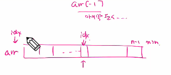
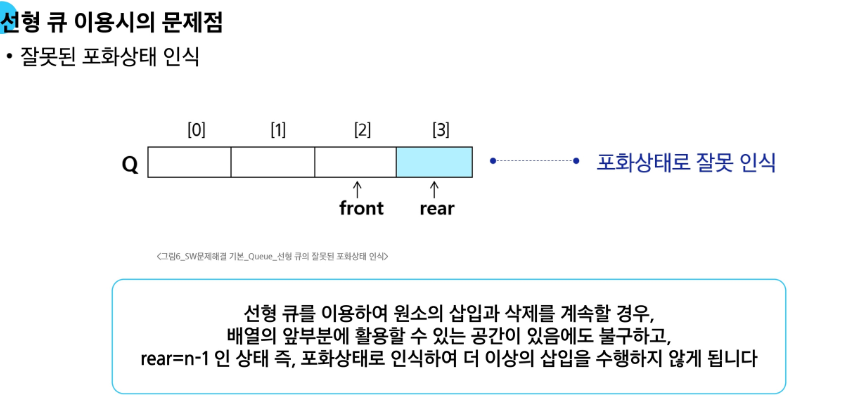
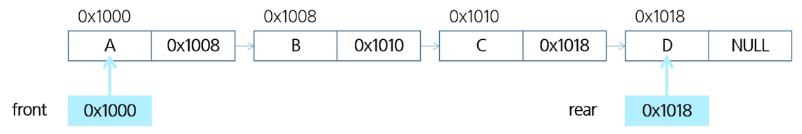
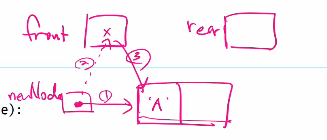

# Queue(큐)

---

### 선입선출 자료 구조
#### : FIFO(파이포) (↔ 스택의 LIFO(후입선출_라이포))

- 줄 서는 순서대로 서비스를 받는 것으로 이해하면 됨

> **큐의 구조**

#### 머리(Front) ```삭제```
: 저장된 원소 중 첫 번째 원소 (또는 삭제된 위치)


#### 꼬리(Rear_리어) ```삽입```
: 저장된 원소 중 마지막 원소

> 💡 **기본 연산**

* 삽입 : enqueue(원소)
* 삭제 : dequeue() 

| 연산 | 기능 |
|------|-------------------|
| **enqueue(item)** | 큐의 뒤쪽(rear 다음)에 원소를 삽입하는 연산 |
| **dequeue()** | 큐의 앞쪽 (front) 에서 원소를 삭제하고 반환하는 연산 |
| **create_queue()** | 공백 상태의 큐를 생성하는 연산, front와 rear 초기화는 -1 |
| **is_empty()** | 큐가 공백상태인지를 확인하는 연산 |
| **is_full()** | 큐가 포화상태인지를 확인하는 연산 |
| **qpeek()** | 큐의 앞쪽(front)에서 원소를 삭제 없이 반환하는 연산 |

> 연산 과정
#### <다시 차근차근 공부하기 (인덱스 차원에서 공부해도 됨)>

- 4단계에서 front 자리는 다시 가리킬 일 없으니까 빼버리는 것?

- 7단계 front == rear면 비워진 것

---

# 선형 큐
### : 데이터를 일렬로 저장하며, 앞에서 꺼내고 뒤에 넣는 기본 큐 구조

이번 자료에서 배열과 연결형 리스트라는 용어는 자료구조에서의 요소
in python: 배열 = list

---
## 구현

중간에 print("Queue_Full")은 디버깅용 코드임.

5. qpeek() : 검색
- 현재 front의 한자리 뒤(front+1)에 있는 원소, 즉 큐의 첫번째 원소를 반환

---
### 선형 큐 연습

```python
# front/rear 신경 안 쓰고 연습
q = []
q.append(1) # enqueue(1)
q.append(2) # enqueue(2)
q.append(3) # enqueue(3)

q.pop(0)
q.pop(0)
q.pop(0)
```



front=rear=-1 은 자료 구조 내 배열에 존재하지 않음을 표현
초기화된 상태로 enqueue나 dequeue되지 않음을 표시한 것. 마지막 원소가 아님.

```python
front = rear = -1
q = [0] * 10

rear += 1 # enq(1)
q[rear] = 1
rear += 1 # enq(2)
q[rear] = 2
rear += 1 # enq(3)
q[rear] = 3

front += 1 # deq()
print(q[front])
front += 1 # deq()
print(q[front])
front += 1 # deq()
print(q[front])

#front가 어디까지 갔느냐가 중요한 것
```

---
# 원형 큐

> #### 선형 큐를 보완하기 위한 방법으로 제시



해결 방법 1 : 할 줄은 해야 함

복사해서 인덱스 연산으로 채우기
반드시 자신의 오른쪽에 있는 값을 끌어와야 함

해결 방법 2 : 1차원 배열 사용
- 논리적으로 배열의 처음과 끝이 연결되어 원형 형태가 된다고 가정하고 사용

---

> 선형 큐와 원형 큐 비교

### 💡 삽입 위치 및 삭제 위치

| 구분     | 삽입 위치                        | 삭제 위치                        |
|----------|----------------------------------|----------------------------------|
| 선형 큐  | `rear = rear + 1`                | `front = front + 1`              |
| 원형 큐  | `rear = (rear + 1) mod n`        | `front = (front + 1) mod n`      |


> 연산과정

#### 이미지 텍스트나 순서도 등으로 정리할 수 있도록 하기

---
> ### 원형 큐 삽입 함수 (enqueue)

```python
def enqueue(item):
    global rear
    if is_full():
        print("Queue_Full")
    else:
        rear = (rear + 1) % len(cq)
        cq[rear] = item
```

## 한 줄씩 설명

1. `def enqueue(item):`  
   - **enqueue**는 큐에 새 원소를 “뒤쪽(rear)”에 넣는 연산.  
   - 매개변수 `item`이 삽입될 값이다.

2. `global rear`  
   - 함수 안에서 전역 변수 `rear`(뒤 인덱스)를 **수정**하려고 하므로 전역임을 명시.  
   - 이걸 빼면 파이썬은 `rear`를 지역 변수로 취급해 오류가 난다.

3. `if is_full():`  
   - **원형 큐가 가득 찼는지** 검사.  
   - 전형적인 원형 큐의 가득 참 조건은  
     ```python
     (rear + 1) % len(cq) == front
     ```

4. `print("Queue_Full")`  
   - 큐가 꽉 찼을 경우 삽입을 수행하지 않고 상태를 출력.  
   - 실제 구현에서는 `return` 또는 `raise OverflowError`를 쓰기도 한다.

5. `else:`  
   - 가득 차지 않았을 때만 삽입을 진행.

6. `rear = (rear + 1) % len(cq)`  
   - **원형 인덱싱의 핵심.**  
   - rear를 한 칸 전진시키되, 배열 끝을 넘어가면 `% len(cq)`로 0부터 다시 시작.  
   - 예) `len(cq)=5`, rear=4 → `(4+1)%5=0` 으로 되돌아감.

7. `cq[rear] = item`  
   - 이동된 rear 위치에 `item`을 저장.  
   - 시간 복잡도는 O(1).

---

### 최소 구동 맥락 (참고 코드)

```python
cq = [None] * 5           # 원형 큐 버퍼
front = 0
rear = 0                  # 빈 큐는 front == rear 상태

def is_full():
    return (rear + 1) % len(cq) == front
```

---

# 연결 큐
: 연결 리스트를 이용해 구현한 큐

> ### 연결 큐의 구조

* #### 단순 연결 리스트(Linked List)를 이용한 큐
    - 큐의 원소: 단순 연결 리스트의 노드
    - 큐의 원소 순서: 노드의 연결 순서. 링크로 연결되어 있음
    - `front`: 첫 번째 노드를 가리키는 링크
    - `rear`: 마지막 노드를 가리키는 링크

* #### 상태 표현
    - 초기 상태: `front = rear = null`
    - 공백 상태: `front = rear = null`

---

* ### [연결 큐 예시_메모리 주소 표현]
front → [A | 0x1008] → [B | 0x1010] → [C | 0x1018] → [D | NULL] ← rear

- `front`가 가리키는 첫 번째 노드: A (주소 `0x1000`)
- `rear`가 가리키는 마지막 노드: D (주소 `0x1018`)
- 각 노드는 데이터와 다음 노드의 주소(링크)를 저장
- 마지막 노드의 링크는 `NULL`을 가리킴



---
# deque(덱)

- 컨테이너 자료형 중 하나로 양쪽 끝에서 빠르게 추가와 삭제를 할 수 있는 리스트류 컨테이너
- 연결 리스트를 직접 만들지 않아도 됨

### 덱의 연산
* append(x) : 오른쪽에 x 추가
* popleft() : 왼쪽에서 요소를 제거하고 반환. 요소가 없으면 IndexError

```python
from collections import deque

q = deque()
q.append(1)     # enqueue()
t = q.popleft() # dequeue()

list_q = []
for i in range(1000000):
    list_q.append(i)
for _ in range(1000):
    list_q.pop(0)
print('end')
# deque_q = deque()
# for i in range(1000000):
#     deque_q.append(i)
# for _ in range(1000000):
#     deque_q.popleft()
# print('end')

```

> 구현 예

```python
class Node:
    def __init__(self, item, n=None):
        self.item = item
        self.next = n


def enqueue(item):  # 연결 큐의 삽입 연산
    global front, rear
    newNode = Node(item)   # 새로운 노드 생성

    if front == None:      # 큐가 비어있다면
        front = newNode
    else:
        rear.next = newNode
    rear = newNode
```

👉 이 코드의 의미를 간단히 설명하면:  
- `Node` 클래스는 **데이터(item)**와 **다음 노드(next)**를 저장하는 연결 리스트 노드 정의.  
- `enqueue` 함수는 새 노드를 생성해 **연결 큐의 뒤쪽(rear)에 삽입**하는 연산.  
  - 큐가 비어 있으면(`front == None`) 새 노드가 **front**와 **rear** 모두가 됨.  
  - 그렇지 않으면 현재 `rear`의 `next`를 새 노드에 연결하고, `rear`를 새 노드로 갱신
    


### 연결형 큐에 있는 노드를 쭉 훑고 싶을 때의 코드
```python
def qpeek():
    return front.item
```
- qpeek()는 큐의 맨 앞 원소를 반환한다.

- 데이터를 삭제하지 않고 단순히 확인만 한다.

- 배열 기반 큐의 q[front]와 동일한 역할을 한다.

### 전체 원소 출력
```python
def print_q():
    f = front
    s = ""
    while f:
        s += f.item + " "
        f = f.next
    return s
```

- f = front : 큐의 첫 노드부터 순회 시작.

- while f: : 노드가 존재하는 동안 반복.

- s += f.item + " " : 현재 노드 데이터를 문자열에 추가.

- f = f.next : 다음 노드로 이동.

- return s : 모든 데이터를 공백으로 이어 붙인 문자열 반환.

---
# 우선순위 큐
: 우선순위를 가진 항목들을 저장하는 큐

- FIFO 순서가 아니라, 우선순위가 높은 순서대로 먼저 나가게 됨
- 우선순위 큐의 적용 분야로 시뮬레이션 시스템, 네트워크 트래픽 제어, 운영체제의 테스크 스케쥴링이 있음

> **배열을 이용한 우선순위 큐**
- 배열을 이용하여 자료 저장
- 원소 삽입 과정에서 우선순위를 비교하여 적절한 위치에 삽입
- 가장 앞에 최고 우선순위의 원소가 위치함

---
# 큐의 활용

---

## 버퍼
: `"전송하는 동안 일시적으로 보관"`
- 데이터를 한 곳에서 다른 한 곳으로 전송하는 동안 일시적으로 그 데이터를 보관하는 메모리의 영역
- 버퍼를 채우는 것을 버퍼링이라고 함.
- 축적을 통한 전송이 이루어지는 것

> 자료 구조

- 일반적으로 입출력 및 네트워크 관련하여 이용
- 순서대로 입/출력/전달 되어야 하므로 FIFO 방식인 Queue 활용

**<마이쮸 시뮬레이션>**
```python
from collections import deque
p = 1  # 처음 줄 설 사람 번호
#q = []
q = deque()
N = 1000000  # 초기 마이쮸 개수
m = 0   # 나눠준 개수
v = 0

while m<N:
    #input()
    q.append((p, 1, 0))     # 처음 줄 서는 사람
    #print(q)
    v, c, my  = q.popleft()
    #print(f'큐에 있는 사람 수 {len(q)+1}, 받아갈 사탕 수{c}, 나눠준 사탕 수{m}')
    m += c
    q.append((v, c+1, my+c))    # 마이쮸를 받고 다시 서는 사람
    p += 1                  # 처음 줄서는 사람 번호
print(f'마지막 받은 사람 : {v}')

```


> 오늘 다시 볼 것

(1) 선형큐

    구현
    - append/pop
    - front/rear

(2) 원형큐

    장점

(3) 우선순위큐

    특징