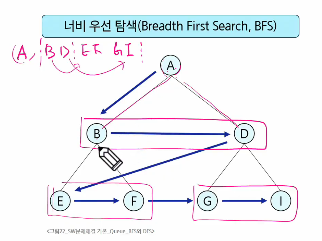
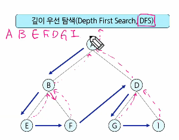
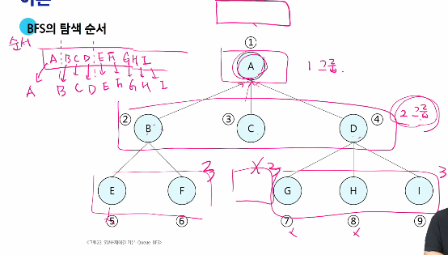

# 큐

(1) 선입선출(FIFO)
(2) 선형큐/원형큐
(3) 덱

오늘은 큐 활용 중 BFS 부터

---
## <그래프를 탐색하는 방법>

### 너비 우선 탐색과 깊이 우선 탐색
* 둘 비교해서 공부하기 (이동 순서도로 파악)




---
## 너비 우선 탐색 (넓이 아니고 너비!) _ BFS
#### : `탐색 시작점의 인접한 정점들을 모두 차례로 방문`한 후에, 방문했던 정점을 시작점으로 하여 다시 인접한 정점들을 차례로 방문하는 방식
- 인접한 정점들에 대해 탐색한 후, 차례로 다시 너비우선탐색을 진행해야 하므로, `선입선출` 형태의 자료구조인 `큐`를 활용해야 함

---
### 탐색순서
- 대기순서 작성해두듯이 큐에 그룹별로 입력하도록 예약
- 1그룹, 2그룹, 3그룹 순으로 같은 그룹 내에서는 순서가 바뀌더라도 불만을 갖지 않도록 하고, 단 그룹의 순서는 달라지지 않음을 보장


- 최소 간선 수를 통해 그룹을 짓게 된다고 볼 수 있음

```python
def bfs(G, v):  # 그래프 G, 탐색 시작점 v
    visited = [0] * (n + 1)   # n : 정점의 개수(이자 번호가 0~n번인 상황)
    queue = []                # 큐 생성
    queue.append(v)           # 시작점 v를 큐에 삽입

    while queue:              # 큐가 비어있지 않은 경우(큐가 비워질 때까지)
        # while front != rear 를 통해 큐가 비어있지 않음 표현 가능
        t = queue.pop(0)      # 큐의 첫번째 원소 반환
        # 인접 노드가 중복해서 큐에 입력되지 않도록 처리해야 함
        if not visited[t]:    # 방문되지 않은 곳이라면
            # if visited[t] == 0: 과 동일
            visited[t] = True # 방문한 것으로 표시
            visit(t)          # 정점 t에서 할 일
            
            for i in G[t]:    # t와 연결된 모든 정점에 대해
                if not visited[i]:  # 방문되지 않은 곳이라면
                    queue.append(i) # 큐에 넣기
```

## BFS 예제

* 초기 상태
- visited 배열 초기화 > visited = [0] * (n+1)
- Q 생성
- 시작점 enqueue

뒷부분은 while queue: 로 돌림

- 그래프에서는 부모-자식 관계 성립하지 않음. 그저 인접할 뿐임.
  (B) - > (C) : 이 경우에는 B에 대해서는 C가 인접하나, C에 대해서는 B는 인접하지 않음
- 나중에 tree에서 관계 나타나니 공부할 것.

* A점부터 시작(시작점이 A, 이 점이 기준이 됨)
- 최단거리를 통한 탐색이라고 느껴질 수 있음
- 인접하고, 처리되지 않은 정점을 enqueue할 것
```
if visited[t] == 0:      (동일)    if not visited[t]:
    visited[t] = 1                    visited[t] = True
```

반복 : 처리할 정점이 남아있으면
    디큐
    아직 방문전이면
        방문표시
        방문안한 인접정점 인큐

* 탐색 진행
- while로 진행해야 하는 상황. 어디까지, 몇 번 할지 정해져있지 않으니까
- 방문 처리하고, 처리된 정점 제외

## 예제 2
** 이 방법을 주로 사용하자

```python
def BFS(G, v, n):  # 그래프 G, 탐색 시작점 v
    visited = [0] * (n + 1)     # n : 정점의 개수
    queue = []                  # 큐 생성
    queue.append(v)             # 시작점 v를 큐에 삽입
    visited[v] = 1

    while queue:                # 큐가 비어있지 않은 경우
        t = queue.pop(0)        # 큐의 첫번째 원소 반환
        visit(t)                # 꺼내서 if로 확인하는 것이 없어졌음
        for i in G[t]:          # t와 연결된 모든 정점에 대해
            if not visited[i]:  # 인큐되지 않은 곳이라면
                queue.append(i) # 큐에 넣기
                # 인큐와 방문예정 표시를 묶어서 중복 방지
                visited[i] = visited[t] + 1  # n으로부터 1만큼 이동
```

그룹 번호의 차이는 최소 몇 개의 간선을 통해 도달할 수 있는지임
보통 BFS는 정점 간 최소 거리를 구하는 형태로 이루어짐
BFS는 최소한의 간선을 거쳐서 도달할 수 있는 인접한 것을 구하므로, 다 탐색하기만 한다면 출발점이 두 개여도 상관없음

```python

# V, E가 8쌍
'''
7 8
4 2 1 2 1 3 5 2 4 6 5 6 6 7 3 7 
'''

def bfs(s, V):  # 시작정점 s, 마지막 정점 V
    # 초기화
    visited = [0] * (V+1)   # visited 생성 # 띄어쓰기 맞추기 #몇 칸할지
    q = []          # 큐 생성
    q.append(s)     # 시작점 인큐
    visited[s] = 1  # 시작점 방문표시
    ----요 부분은 내내 써서 자연스럽게 쓸 수 있도록 숙지하기
    while q:        # 큐에 정점이 남아있으면 front != rear
        t = q.pop(0)    # 디큐
        print(t)        # 방문한 정점에서 할일 # visit()
        for w in adj_l[t]:  # 인접한 정점 중 인큐되지(방문하지) 않은 정점 w가 있으면
            if visited[w]==0:
                q.append(w)     # w인큐, 인큐되었음을 표시
                visited[w] = visited[t] + 1 #visited[t]에서 한 칸 옮겨갔음 표시

V, E = map(int, input().split()) # 1번부터 V번 정점, E개의 간선 # 마지막 정점, 간선 수
arr = list(map(int, input().split())) # 행 번호가 곧 정점번호로 작용할 수 있음
# 인접리스트 -------------------------
adj_l = [[] for _ in range(V+1)]   #V번 행까지 준비
for i in range(E):
    v1, v2 = arr[i*2], arr[i*2+1]
# for i in range(0, E*2, 2):
    # v1, v2 = arr[i], arr[i+1]   
    adj_l[v1].append(v2)
    adj_l[v2].append(v1)    # 방향이 없는 경우(있을 때는 쓰지 않음. 유향이면 사용 안 함)
# 여기까지 인접리스트 -----------------
bfs(1, V)
```


