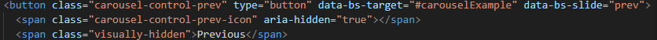
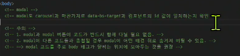
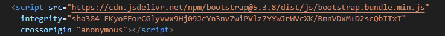
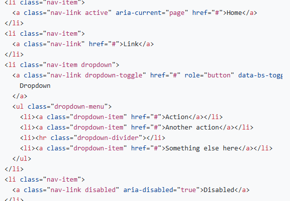

# 📘 Bootstrap & Reset CSS 가이드

## 1. Bootstrap 개요
- **CSS 프론트엔드 프레임워크 (Toolkit)**
  - 미리 정의된 디자인 요소들을 제공하여 웹사이트를 빠르고 일관성 있게 개발할 수 있도록 지원
  - 생산성과 유지보수 측면에서 유리
- **컴포넌트**
  - 레고 조각처럼 미리 정의된 스타일 블록
  - 버튼, 네비게이션 바, 카드 등 UI 요소로 재사용 가능

---

## 2. Bootstrap 시작하기

### 2.1 Docs 특징
- 반응형 웹사이트 지원
- 다양한 컴포넌트 및 유틸리티 클래스 제공
- HTML에 **CSS / JS 파일을 링크**하여 사용  

### 2.2 CDN
- **CDN(Content Delivery Network)**을 통해 Bootstrap 파일을 불러옴  
- 특징:
  - 서버와 사용자 간 **물리적/지리적 거리 최소화**
  - 가까운 서버에서 리소스를 제공 → 로딩 속도 향상
  - 링크 주소에 `cdn` 명시

---

## 3. Bootstrap 기본 사용법

### 3.1 Spacing Utilities
- **m** = margin  
- **p** = padding  

#### 방향 지정
- `t` = top  
- `b` = bottom  
- `s` = left(start)  
- `e` = right(end)  
- `y` = top, bottom  
- `x` = left, right  
- `blank` = 4 sides  

#### 크기 단위
| 이름 | 값 (상대) | 값 (절대) |
|------|-----------|-----------|
| 0    | 0 rem     | 0px       |
| 1    | 0.25 rem  | 4px       |
| 2    | 0.5 rem   | 8px       |
| 3    | 1 rem     | 16px      |
| 4    | 1.5 rem   | 24px      |
| 5    | 3 rem     | 48px      |
| auto | auto      | auto      |

📌 예시  
```html
<div class="mt-3">  <!-- margin-top: 1rem -->
<div class="px-2">  <!-- padding-left/right: 0.5rem -->


## 4. Bootstrap 우선순위
- 모든 클래스에 `!important` 선언 적용
- 이유: **혹시나 클래스명이 겹치더라도, 부트스트랩이 우선 적용되도록 보장**

---

# Reset CSS

## 모든 HTML 요소 스타일을 일관된 기준으로 재설정하는 간결하고 압축된 `규칙 시트`

### Reset CSS 사용 배경
- 모든 브라우저는 각자의 **user agent stylesheet**를 가지고 있음  
  - 웹사이트를 보다 읽기 편하게 하기 위해
- 문제는 이 설정이 브라우저마다 상이하다는 것  
- 모든 브라우저에서 웹사이트를 동일하게 보이게 만들어야 하는 개발자에겐 매우 골치 아픈 일  
- 웹의 기준에 최소한만 맞추고 모두 동일하자

### User-agent stylesheets
- 모든 문서에 기본 스타일을 제공

### Normalize CSS
- 웹 표준 기준으로 브라우저 중 하나가 불일치 한다면 차이가 있는 브라우저를 수정하는 방법
- 경우에 따라 Edge 또는 IE가 표준에 따라 수정할 수 없는 경우도 있는데, 이때는 해당 브라우저 스타일을 나머지 브라우저에 적용시킴

### Typography
- 태그는 h1인데, 클래스로 구분하여 스타일 부여 가능  
- [공식문서 참고]

---

### Bootstrap Color System
- 클래스를 조합해 `color`, `background` 활용
- 정해진 이름을 사용하여 일관된 색상 시스템 제공

---

### Component
: 기능별 레고 블록 / UI 관련 요소  
예) 버튼, 네비게이션 바, 카드 디자인 등  

- **role** 속성은 접근성 측면에서 활용

#### 버튼
```html
<button class="btn btn-primary">버튼</button>

속성을 두 개를 써서, 버튼임과 버튼의 색을 동시에 부여함.

#### 캐로셀(회전목마)



target을 통해서 어디가 동작하는지에 대한 원리를 파악해서 적용 범위 혹은 대상을 확연히 알아두어야 함.
여러 개를 쓰고 싶다면 각각 배정되도록 하기

#### 모달
누르면 화면이 흐려지면서 별도로 등장
그래서 버튼과 모달 각자 존재
class="btn-close"와 같이 평소에 가려져있다가 조건이 충족되면 출력되는 것
모달도 캐로셀과 마찬가지로 data-bs-target과 component의 id 값이 일치하는지 확인해야 함

레이아웃에 보기에 방해가 되므로, 가장 아래에 배치

모달 코드는 주로 바디 태그가 닫히는 위치에 모아두는 것을 권장



+ 자바스크립트의 역할(동작하도록 함)



#### navbar

햄버거 버튼의 작용이 이루어지는 반응형

---
# Semantic Web(의미론적인 web)

의미가 기능으로 주어질 수는 없지만 표현법으로 담아낼 수 있음

p태그에서 커진 것과 h1의 크기가 비슷한 것은 의미론적으로 다름
외형보다 요소 자체의 의미에 집중하는 것이 HTML 요소가 의미를 갖는다는 것임

검색엔진 및 개발자가 웹 페이지의 콘텐츠를 이해하기 쉽게 해주는 것. 즉 기계도 알 수 있도록 함.

* Semantic 요소가 브라우저에 보여질 때는 div 요소와 똑같이 나오게 되지만, header/nav/article 등 각각 의미를 갖도록 하는 것

## CSS 방법론
: 효율적으로 유지 보수가 용이하게 작성하기 위한 일련의 가이드라인

### OOCSS
: 객체 지향적 접근법을 적용하여 CSS 구성하는 방법론

순서
1. 구조와 스킨 분리
2. 컨테이너(담는 것)와 콘텐츠(담기는 것) 분리

2) 
- 객체에 직접 적용하는 대신 객체를 둘러싸는 컨테이너에 스타일을 적용
- 스타일을 정의할 때 위치에 의존적인 스타일을 사용하지 않도록 함
- 콘텐츠를 다른 컨테이너로 이동시키거나 재배치할 때 스타일이 깨지는 것을 방지

```
Bootstrap의 미디어 객체(Utilities>Flex>Media object)는 컨테이너와 콘텐츠 분리 원칙을 잘 보여줌
```

피드백도 OOCSS에 따라 받도록 해보기.

정확하게 어디다 쓰는지 알기
flex는 '배치를 다시 하고 싶은 영역'에 써주기