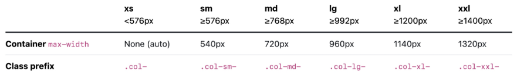

# 반응형 웹

## Bootstrap Grid System
: 웹 페이지 레이아웃을 조정하는 데 사용되는 12개의 컬럼으로 구성된 시스템

화면마다 칸이 조정되도록 설정된 시스템

---
## 구조
- Container; column을 담고 있는 공간
- Column; 실제 콘텐츠를 포함하는 부분
- Gutter; 컬럼 간 패딩, 마진 조정
- row ; 한 개의 row 안에 12개의 column 영역이 구성

VS 코드 숫자 옆 화살표로 접어가면서 div의 포함관계 파악할 수 있음

col 숫자 설정 안 하면 부트스트랩이 알아서 12칸을 나눔, 그러나 주어지도록 하는 것이 좋음
div class="col-4" 이면 4칸을 직접 할당하는 것.

- div 하나당 하나하나 다 컬럼으로 존재

- 두 줄이니까 row를 만들면 되는 거 아니냐? 현재는 같은 콘텐츠라고 보는 가운데 화면 사이즈에 맞춰서 하나의 화면에서 움직이게 됨. 그러나 다른 row 라는 건 다른 콘텐츠라는 뜻으로, 배치와 의미 면에서 달라지게 되므로 그렇게 이해하면 안 됨.

---
## Offset(상쇄)

---

## Gutters
좌우는 padding, 상하는 margin으로 여백 생성
이만큼을 컨테이너로 묶어서 정확하게 열 두 칸으로 나눴다고 합시다.
만약에 패딩이 아니라 정말 좌우로 밀어내면 어떤 일이 벌어질까?
사실 가로는 제한되어있거든요
튕겨져 나가게 되어버리거든요
그래서 좌우는 제한된 선(길이)을 지켜야 하기 때문에 마진으로 밀 수가 없어요
울퉁불퉁한 레이아웃은 존재할 수 없고 선을 지켜야 하기 때문에 꽉 찬 12칸 내에서 패딩으로 확보하고 콘텐츠를 줄이는 수밖에 없는 거에요
상하는 실제로 마진으로 해서 멀어지는 거고, 좌우는 멀어지지 않는 거고 실제 멀어지는 것이 아니라, 패딩으로 미는 것처럼 착각하게, 보이게 하는 거에요
좌우 간격은 실제 컬럼 간 변하지 않음/콘텐츠 너비가 변하는 것

컬럼은 사실 붙어있어요.

떨어진 것처럼 보이죠. 왜? 콘텐츠가 줄어들고 패딩이 늘어났기 때문이에요
마진으로 밀면 콘텐츠가 튕겨져 나가겠죠. 하지만 위아래는 상관없다
거터를 줄 때는 행에게 줍니다.
row가 핵심이에요. 거터의 좌우 값을 정함
gx-0로 거터가 가린 간격을 초기화 가능

위아래는 기본적으로 거터가 없거든요
gy를 주는 거는 마진으로 밀어서 실제로 멀어지는 겁니다

특정 컬럼에 적용하려면, (잘 안 주긴 하는데)
적용이 되긴 하는데 그렇게 레이아웃하는 일은 없음

레이아웃이라 하면 일정한 모양이 반복되는 개념이기 때문에 설계에서 예외를 주지 않는 편
그래서 col보다 row에 의해 움직인다고 보긴 해요 단일 컬럼에는 적용하거나 하진 않아요

상하좌우를 동시에 주려면, x,y 생략하고 g-(숫자)로 주면 돼요

---

# Responsive Web Design
: 디바이스 종류나 화면 크기에 상관없이, 어디서든 일관된 레이아웃 및 사용자 경험(UX)을 제공하는 디자인 기술

12개의 `column`과 6개의 `breakpoint(분기점)`를 사용하여 반응형 웹 디자인 구현

화면 너비에 따라 6개의 분기점 제공, 다양한 화면 크기에서 적절하게 배치하기 위한 분기점으로 범위 내에서는 같은 디자인과 칸수로 배정하는 등의 흐름인 것

각 분기점마다 설정된 최대 너비 값 **"이상으로'** 화면이 커지면 그리드 시스템 동작이 변경됨

이름을 col 다음에 섞어주시면 끝나요.

col-(사이즈)-(칸 수)
col-sm-4 : small 일 때 4칸을 차지함

 : ~ 이상의 개념임, 즉 이 경우에는 small 이상이면, 이라는 조건이 주어진 것으로 보면 됨

: 구간을 나눠서 조건을 각각 충족하면 반응형 디자인이 되도록 만드는 것

~이상 개념이기 때문에 꼭 모든 조건을 설정하지 않아도 됨. extra small에서 medium으로 구간 설정도 가능

---
CSS 레이아웃 기술은 상호 보완적이며, 최적의 기술을 선택하고 활용하기 위해서는 실제 개발 경험이 필수적
각각 고유한 특성을 가짐

