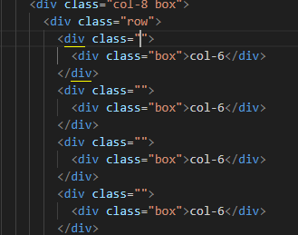

# 반응형 웹

## Bootstrap Grid System
: 웹 페이지 레이아웃을 조정하는 데 사용되는 12개의 컬럼으로 구성된 시스템

화면마다 칸이 조정되도록 설정된 시스템

---
## 구조
- Container; column을 담고 있는 공간
- Column; 실제 콘텐츠를 포함하는 부분
- Gutter; 컬럼 간 패딩, 마진 조정
- row ; 한 개의 row 안에 12개의 column 영역이 구성

VS 코드 숫자 옆 화살표로 접어가면서 div의 포함관계 파악할 수 있음

col 숫자 설정 안 하면 부트스트랩이 알아서 12칸을 나눔, 그러나 주어지도록 하는 것이 좋음
div class="col-4" 이면 4칸을 직접 할당하는 것.

- div 하나당 하나하나 다 컬럼으로 존재

- 두 줄이니까 row를 만들면 되는 거 아니냐? 현재는 같은 콘텐츠라고 보는 가운데 화면 사이즈에 맞춰서 하나의 화면에서 움직이게 됨. 그러나 다른 row 라는 건 다른 콘텐츠라는 뜻으로, 배치와 의미 면에서 달라지게 되므로 그렇게 이해하면 안 됨.

---
## Offset(상쇄)

---

## Gutters
# 12컬럼 레이아웃 여백 정리

## 1. 좌우는 Padding
- 가로 폭은 정확히 12칸으로 제한.
- 좌우를 **margin**으로 밀면 칸이 튕겨져 나가 레이아웃이 깨짐 → ❌
- **padding**으로 주면:
  - 컬럼 자체 폭은 유지
  - 내부 콘텐츠가 줄어듦
  - 떨어져 보이는 효과 발생
- **즉, 컬럼은 실제로 붙어있다.**
  - 떨어져 보이는 건 padding 때문.

## 2. 상하는 Margin
- 위아래는 “선 제한”이 없으므로 실제로 멀어져도 무방.
- 세로 간격(거터)은 **margin**으로 구현.
- Bootstrap 규칙:
  - `gy-숫자`: 세로 간격
  - 실제 margin으로 위아래 행 간 떨어짐.

## 3. 거터(Gutter)의 본질
- 거터는 **row가 관리**한다.
- 주요 속성:
  - `gx-숫자`: 좌우 패딩 (컬럼 간 간격)
  - `gy-숫자`: 상하 마진 (행 간 간격)
  - `g-숫자`: 상하좌우 동시에
  - `gx-0`: 좌우 간격 제거 (붙여쓰기 레이아웃)

## 4. 레이아웃 설계 원칙
- 12컬럼 레이아웃은 **일정한 반복과 규칙성**이 전제.
- 개별 col에 margin/padding을 따로 주면 레이아웃 붕괴 위험 → 거의 안 씀.
- **row > col 구조**:
  - row가 간격 관리
  - col은 내용만 차지

---

# ✅ 시험 대비 핵심 키워드
- 좌우 간격 = **padding** (선 유지, 콘텐츠 폭 줄어듦)
- 상하 간격 = **margin** (실제로 멀어짐)
- 거터 = **row가 관리** (`gx`, `gy`, `g`)
- **col은 붙어있음**, 떨어져 보이는 건 padding 효과

# Responsive Web Design

## 정의
- 디바이스 종류나 화면 크기에 상관없이, 어디서든 일관된 레이아웃 및 사용자 경험(UX)을 제공하는 디자인 기술
- 12개의 `column`과 6개의 `breakpoint(분기점)`를 사용하여 반응형 웹 디자인 구현

---

## Breakpoint (분기점)
- 화면 너비에 따라 6개의 분기점 제공
- 다양한 화면 크기에서 적절한 배치를 위해 사용
- **분기점의 개념**:  
  - 해당 범위 내에서는 같은 디자인과 칸 수 유지  
  - **최대 너비 이상**으로 화면이 커지면 → 그리드 시스템 동작 변경

---

## Column 사용법
- `col-(사이즈)-(칸 수)` 형식
- 예시:
  - `col-sm-4`: 화면이 **small 이상일 때** 4칸 차지
  - `
`: small 이상이면 6칸 차지
  - `
`:  
    - extra small에서는 12칸  
    - small 이상에서는 6칸  
    - medium 이상에서는 12칸  

### 특징
- **~ 이상 개념**이므로 모든 조건을 다 설정하지 않아도 됨
- 예: extra small → medium으로 바로 구간 설정 가능

---

## 핵심 요약
- 반응형 웹은 **12컬럼 + 6개 분기점**을 기반으로 함
- `col-(breakpoint)-(span)` 규칙으로 레이아웃 정의
- breakpoint는 **최소 너비 이상 조건**으로 적용됨
- 필요한 구간만 설정해도 반응형 동작 가능
- CSS 레이아웃 기술은 상호 보완적이며, 실제 개발 경험이 중요

---
flex-grow는 아이템이 flex-basis의 값보다 커질 수 있는지 결정하는 속성
기본값은 0으로, 0보다 큰 값이 세팅되면 해당 아이템이 Flexible Box로 변하고 원래의 크기보다 커지며 빈 공간을 메우게 된다.

.item1 { flex-grow: 1; }
.item2 { flex-grow: 2; }
.item3 { flex-grow: 1; }

 :  한 줄에 컬럼 하나라는 뜻의 row-cols-1

