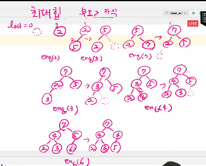

# 트리

## 전,중,후위순회

포화 이진트리인 경우: (2 * i), (2 * i +1) 
일반 이진트리인 경우: 
부모 인덱스 기준 자식번호 저장

## 리스트 vs BST

- **BST**는 리스트보다 더 빠른 삽입 / 삭제 / 탐색이 가능하다.

### 리스트 성능
- 삽입: O(n), 단 맨 끝 삽입은 O(1)  
- 삭제: O(n), 단 맨 끝 삭제는 O(1)  
- 탐색: O(n)

### BST 성능
- 삽입: 평균 O(logN)  
- 삭제: 평균 O(logN)  
- 탐색: 평균 O(logN)

# 이진 탐색 트리 (BST, Binary Search Tree)

- 탐색 작업을 효율적으로 하기 위한 자료구조
- 모든 원소는 서로 다른 유일한 키를 갖는다.
- key(왼쪽 서브트리) < key(루트 노드) < key(오른쪽 서브트리)
- 왼쪽 서브트리와 오른쪽 서브트리로 이진 탐색 트리다.
- 중위 순회하면 오름차순으로 정렬된 값을 얻을 수 있다.

## BST 예시
          (8)
         /   \
       (3)   (10)
      /   \      \
    (2)   (5)    (11)
           \
           (6)

- 루트(8)를 기준으로, 왼쪽은 루트보다 작은 값들(2,3,5,6),  
  오른쪽은 루트보다 큰 값들(10,11)으로 구성된다.
  
---
## 탐색연산

### BST 탐색 과정

- 루트에서 시작한다.
- 탐색할 키 값 `x`를 루트 노드의 키 값과 비교한다.
  - (키 값 `x` = 루트노드의 키 값)인 경우: 원하는 원소를 찾았으므로 탐색 연산 성공
  - (키 값 `x` < 루트노드의 키 값)인 경우: 루트노드의 **왼쪽 서브트리**에 대해서 탐색 연산 수행
  - (키 값 `x` > 루트노드의 키 값)인 경우: 루트노드의 **오른쪽 서브트리**에 대해서 탐색 연산 수행
- 서브트리에 대해서 순환적으로 탐색 연산을 반복한다.

# BST 삽입 연산

1. 먼저 탐색 연산을 수행 
: 루트에서 시작하며 탐색에서 탐색 실패가 결정되는 위치가 삽입 위치가 됨
   삽입할 원소와 같은 원소가 트리에 있으면 삽입할 수 없으므로, 같은 원소가 트리에 있는지 탐색하여 확인.
2. 삽입할 키 값 `x`를 현재 노드의 키 값과 비교한다.
   - `x < 현재 노드 값` → 왼쪽 서브트리로 이동
   - `x > 현재 노드 값` → 오른쪽 서브트리로 이동
3. 이동한 자리가 **비어 있으면 삽입**한다. (즉 탐색 실패한 위치에 원소를 삽입)
4. 비어 있지 않다면 위 과정을 반복한다.

📌 시간 복잡도: 평균 O(logN), 최악(편향 트리) O(N)

---

# BST 삭제 연산

1. 루트에서 시작하여 삭제할 키 값 `x`를 탐색한다.
2. 찾았다면, 다음 3가지 경우에 따라 처리한다.

- **Case 1: 자식이 없는 노드(리프 노드)**  
  → 단순히 노드를 제거한다.

- **Case 2: 자식이 하나인 노드**  
  → 노드를 삭제하고, 자식 노드를 부모와 직접 연결한다.

- **Case 3: 자식이 두 개인 노드**  
  → 두 가지 방식 중 하나를 선택:
    - (a) **왼쪽 서브트리에서 최댓값**을 가져와 대체 후 해당 노드 삭제  
    - (b) **오른쪽 서브트리에서 최솟값**을 가져와 대체 후 해당 노드 삭제
    - 균형이 깨질 수 있으므로 균형을 유지시키는 알고리즘 존재

📌 시간 복잡도: 평균 O(logN), 최악 O(N)

---

> ### 이진 탐색 트리의 성능
- 탐색, 삽입, 삭제 시간은 트리의 높이만큼 시간이 소요
- 해쉬 검색 : 변환하는 시간만 걸리고. 추가 저장 공간이 필요

---
# 힙

`완전 이진 트리에 있는 노드 중 키값이 가장 큰 노드나 키값이 가장 작은 노드를 찾기 위해 만든 자료 구조`

* 최대 힙
  - `부모노드 키값 > 자식 노드의 키 값`
  - 루트 노드: 키값이 가장 큰 노드
  - 키값이 가장 큰 노드를 찾기 위한 "완전 이진 트리" 구조
* 최소 힙
  - `부모노드 키값 < 자식 노드의 키 값`
  - 루트 노드: 키값이 가장 작은 노드
  - 키값이 가장 큰 노드를 찾기 위한 "완전 이진 트리" 구조
    
1. 완전 이진 트리 유지
2. 마지막 정점 번호(자식) 다음에 들어갈 자리 확장하여 확보
3. 부모를 정점번호//2 해서 찾기
4. 부모가 가진 키값과 자식이 가진 키값을 비교해서 힙 조건 충족하는지 확인해서 상황 종료

# 힙 연산 - 삽입

## 삽입 조건
1. 완전 이진트리 유지
2. 부모 노드 ≥ 자식 노드 (최대 힙 기준)

---

## 삽입 과정 (예: 23 삽입)

1) 새로운 노드를 마지막 위치에 삽입  
   - 배열 인덱스의 마지막 자리에 23을 넣는다.  
   - (삽입 전) [20, 15, 19, 7, 6, 13]  
   - (삽입 후) [20, 15, 19, 7, 6, 13, 23]

2) 부모 노드와 비교 후 자리바꾸기 (Heapify Up)  
   - 23의 부모 노드는 19  
   - 23 > 19 → 자리 교환

3) 다시 부모와 비교  
   - 새 부모는 20  
   - 23 > 20 → 자리 교환 → 루트로 이동

---
## 결과 트리 (최대 힙 유지)
- 최종적으로 최대 힙의 성질(부모 ≥ 자식)을 만족한다.
- 삽입 연산 시간 복잡도: O(logN)

> 삭제 연산-힙

- 힙에서는 루트 노드의 원소만을 삭제할 수 있음
- 루트 노드의 원소를 삭제하여 반환함
- 힙의 종류에 따라 최대값 또는 최소값을 구할 수 있음

# 힙 연산 - 삭제 (최대 힙 기준)

## 삭제 조건
- 힙에서 삭제 연산은 **항상 루트 노드(최댓값)**를 삭제한다.
- 완전 이진트리를 유지해야 하므로, 마지막 노드를 루트로 올린 뒤 재정렬한다.

---

## 삭제 과정

1) 루트 노드 삭제  
   - 루트(최댓값)를 제거한다.  
   - 대신 **마지막 노드를 루트 자리로 이동**시킨다.

2) 자식 노드와 비교 (Heapify Down)  
   - 루트에서부터 내려가면서 **더 큰 자식 노드와 교환**한다.  
   - 부모 ≥ 자식 조건을 만족할 때까지 반복한다.

---

## 예시

### 초기 힙
```
       23
     /   \
   15     20
   / \    / 
  7   6  13
 /
19
```
### Step 1: 루트(23) 삭제, 마지막 노드(19) → 루트로 이동
```
      19
    /   \
  15     20
  / \    / 
 7   6  13
```
### Step 2: Heapify Down (19 vs 20) → 교환
```
     20
    /   \
  15     19
  / \    / 
 7   6  13
```

- 이제 힙 속성(부모 ≥ 자식)이 유지됨.

---

## 결과
- 삭제 후 루트는 `20`  
- 힙 구조와 성질을 유지한 채 정렬됨  
- 삭제 연산 시간 복잡도: **O(logN)**

---
## 힙을 이용한 우선순위 큐

[heap_max.py 참고]

- 최소 힙: 작은 키의 우선순위가 높음
- 최대 힙: 큰 키의 우선순위가 높음
- 힙의 키를 우선순위로 활용하여 우선순위 큐를 구현
- 완전이진트리로 구현된 자료구조로서, 키 값이 가장 큰 노드나 가장 작은 노드를 찾기에 적합한 자료구조



힙 != 이진탐색트리 : 부모-자식 관계 분석에만 작용


