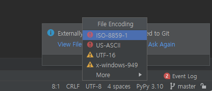
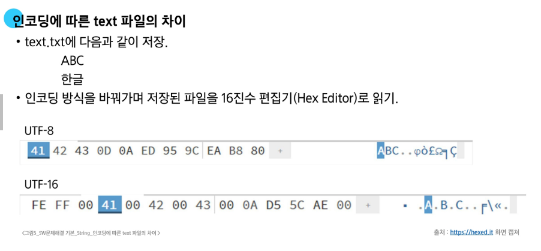
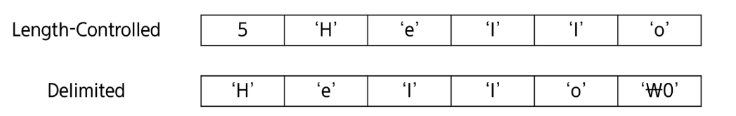
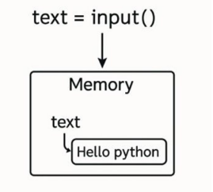
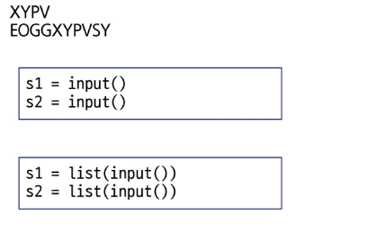
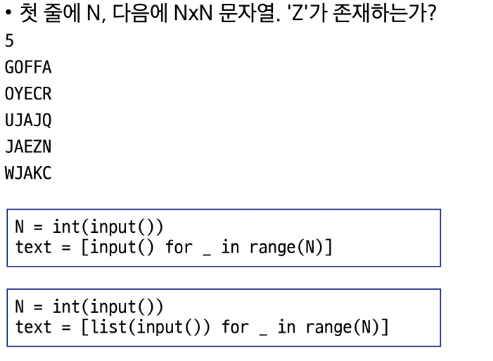
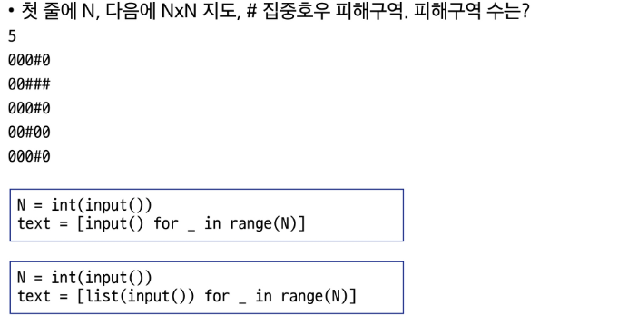
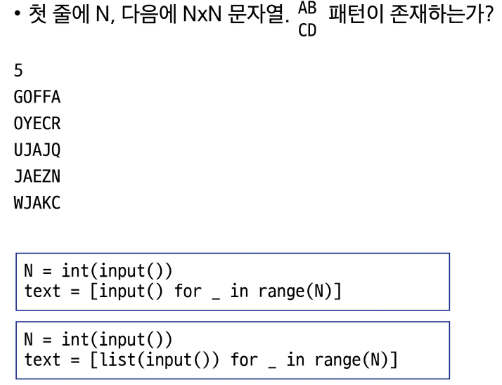
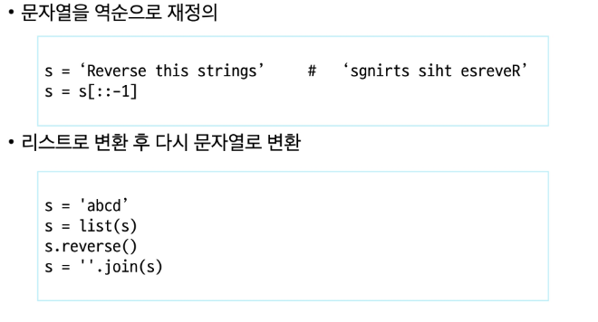

# **코드 체계**
: 문자에 대응되는 숫자

ex. 1967년 미국에서 제정된 문자 인코딩 기준인 ASCII는, 7-bit 인코딩으로 128문자를 표현하며 33개의 출력 불가능한 제어 문자들과 공백을 비롯한 95개의 출력 가능한 문자들로 이루어짐

---
**확장 아스키**

표준 문자 이외의 악센트 문자, 도형 문자, 특수 문자, 특수 기호 등 부가적 문자를 128개 추가

---

**유니코드**

다국어 처리를 위해 표준인 유니코드를 만듦

- 유니코드를 저장하는 변수의 크기를 정의함
  - 그러나 바이트 순서에 대해서는 표준화가 이루어지지 못함
- 파일을 읽을 때 UCS-2인지 UCS-4인지 인식하고 각 경우를 구분해서 모두 다르게 구현해야 하는 문제 발생하여 유니코드의 적당한 외부 인코딩이 필요하게 됨

---
> **바이트 단위 저장 순서**
> 
: 바이트 단위 저장 순서가 정해지지 않은 경우 잘못된 해석 가능성
- 여러 바이트로 이루어진 데이터를 저장하는 방식을 Endian이라고 함
- Big-endian은 상위 바이트(MSB)를 가장 낮은 주소에 저장
- Little-endian은 하위 바이트(LSB)를 가장 낮은 주소에 저장

**유니코드 인코딩**
(일부만 담음)

* UTF-8(in web)
  - MIN : 8-bit , MAX : 32-bit(1 Byte * 4)
  - 필요한 크기에 따른 저장 방법 예
    - 0xxxxxxx
    - 110xxxxx 10xxxxxx -> 5+6 = 11
    - 1110xxxx 10xxxxxx 10xxxxxx -> 4+6+6 = 16
  
* UTF-16(in windows, java)
  - MIN : 16-bit , MAX : 32-bit(2 Byte * 2)
  
* UTF-32(in unix)
  - MIN : 32-bit , MAX : 32-bit(4 Byte * 1)
---
**[실제 파이참 캡쳐]**



---
> **Python 인코딩**
* UTF-8
  - 2.x 버전은 기본 인코딩 방식이 ASCII로 UTF-8 사용 시 코드 첫 줄에 다음 문장 추가해야 함
    * #-\*-coding:utf-8-\*-
  - 3.x 버전은 UTF-8 방식이 기본이기에 표시 생략
  
* 다른 인코딩 방식으로 처리 시 첫 줄에 작성하는 항목에 원하는 인코딩 방식을 지정해주면 됨
---
 
---
> **코드체계의 핵심**

: 전 세계의 모든 문자를 컴퓨터가 일관되게 표현하고 처리하는 것

---
# 문자열

: 문자들이 순서대로 나열된 데이터

> **문자열 분류**

- length-controlled 문자열
  - 문자열 길이 정보를 함께 저장해서, 그 길이만큼 문자 데이터를 읽는 방식
  - 자바, 파이썬, 네트워크 패킷에 사용됨

- Delimited 문자열
  - 문자열의 '끝'을 나타내는 특정한 구분자(Delimiter)가 있어서, 구분자가 나올 때까지 문자열로 인식
  - C언어는 널문자(null, '\0')를 사용
  


> 파이썬 str 클래스 구조
- 길이 외 다른 정보도 저장
  - PyObject_HEAD: 모든 파이썬 객체가 상속하는 공통 구조
  - length: 문자열 길이
  - hash : 문자열의 해시값으로, 딕셔너리 키로 쓸 때 사용
  - interned: 같은 문자열을 관리하는 플래그
  - kind : 문자열 인코딩의 크기
  - data : 문자열이 저장된 실제 메모리 주소를 가리키는 포인터

> 다른 언어에서의 문자열

> C언어에서의 문자열

- 문자열은 문자들의 배열 형태로 구현된 응용 자료형
- 문자 배열에 문자열을 저장할 때는 항상 마지막에 끝을 표시하는 널문자('\0') 필요
- 문자열 처리에 필요한 연산을 함수 형태로 제공
  strlen(), strcpy(), strcmp(), ...

> 자바에서의 문자열

- 문자열 데이터를 저장, 처리해주는 '클래스' 제공
- String 클래스
- 문자열 처리에 필요한 연산을 연산자, 메소드 형태로 제공

> Python3에서의 문자열
- 텍스트 데이터의 취급방법이 통일되어 있음
  - python2와 달리 바이트 문자열과 유니코드 구분이 없음
  - 유니코드 기반이라 어떤 언어나 기호도 동일한 방식으로 처리
  - 문자열 기호
    - '(홑따옴표), "(쌍따옴표), ...
  - 문자열은 데이터 순서가 구분되는 시퀀스 자료형으로 분류됨
  - **문자열은 튜플과 같이 요소값을 변경 할 수 없음!!(immutable)**
    1. 인덱스 사용 가능
    2. 요소값을 변경할 수 없음 (보호되는 영역에 코드의 일부로서 저장되어 있음)

**자습하면서 마저 필기

---
**세 언어의 차이**

C는 아스키 코드로 저장
Java는 유니코드(UTF=16, 2-Byte)로 저장 _ 클래스 기반
Python3는 유니코드(UTF-8)로 저장

---
> **Python에서의 문자열 입력**

- input() 함수로 읽기
- 빈칸을 포함해 한 행 읽어들이기

---

> **입력처리**

input()의 결과는 항상 문자열!!

값을 바꾸거나 뽑아낼 필요없으면 input만.
뽑아내거나 바꿔야 하면 리스트로 변환해야 함



> S1이 S2에 모두 존재하는가?

XABUPCVZ 로 되어 있어도 있다고 해야 하므로 따로따로 검사하도록 해야 함
```
있는지 확인만 하면 되면 input
있는지 하나하나 봐야 하면 list로 바꿔둬야 함
```

**문자열은 불변타입으로 변경이 불가능하기에,**
글자를 바꿔야 할 필요가 있다면 문자열을 리스트로 바꿔서 사용해야만 한다

---
> **'모두 있다' vs '모두 없다' 라고 생각할 것인가의 생각 방향 정하기**

```
일단 하나를 정하고 하나라도 일치하지 않는 경우에 상황을 반전시켜서 중단해서 결과 내면 되는 것
```
```
#첫 전제를 전부 있다고 잡은 후에

  #s1에서 글자 하나 떼와서 이름을 c로 정하고
  for c in s1:

    # 이 c라는 글자가 s안에 없나?
      if c not in s2:

      # 문제는 전부 있어야 한다는 게 전제니까 하나라도 없으면 False

        answer = False
        break

      # 반복을 전부 돌고 나면
        if answer:
         print("전부 있네요")

        else answer:
         print("전부 있진 않네요")
```

---


* input = 바꿀 필요 없을 때

* list = 특정 행이나 열 번호 등이 필요할 때

---


> 그냥 그대로 문자열로 써야 하는 경우에 해당
list로 해야 비교가 가능
---


큰 사각형과 작은 사각형 문제

- 기준 위치를 잡는 것이 최우선!
  

숫자를 스트링으로 저장해서 옆칸도 0이라는 스트링인지 검증하는 형식으로 상하좌우 이동할 수 있는 칸 구해보기

---

# 연산



reverse는 메서드
reversed는 함수

위는 슬라이싱으로 복제본 만드는 거
아래는 직접 뒤집는 가변형 데이터인 거

**join 개념 다시 익히기

직접 타이핑 해서 알아보기
---
> 회문


