# Function Call
**: 프로그램에서의 함수 호출과 복귀에 따른 수행 순서 관리**

- 가장 먼저 호출된 함수가 가장 먼저 실행을 완료하고 복귀하는 구조로, 일명 ```후입선출``` 구조의 스택을 이용하여 수행순서 관리
- 들여쓰기 없이 시작하는 부분이 main()이라고 생각하면 됨

### **시스템 스택**
 - 함수 수행에 필요한 지역변수, 매개변수 및 수행 후 복귀할 주소 등의 정보를 저장함
 - 함수 호출이 발생하면 스택 프레임에 저장하여 시스템 스택에 삽입

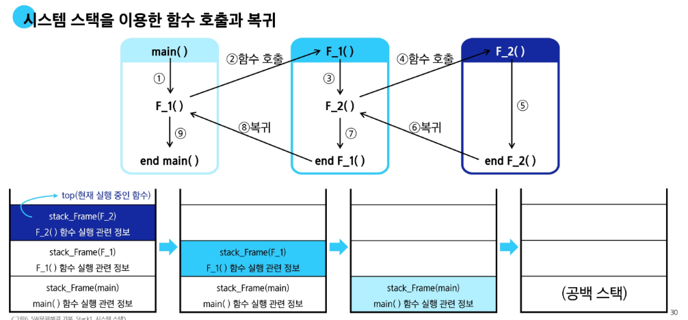

---
## 📌 시스템 스택 용어 정리

### **프로그램 카운터(PC)**
- 코드에서 빨간 점을 찍어놓으면 그 시점에 멈추도록 되어 있는 것과 동일한 원리
- 그 자리에서 프로그램이 실행되어야 한다는 것을 저장해두는 것
- 다음에 실행할 명령어의 메모리 주소를 저장하는 레지스터.
- 명령어 실행 후 자동으로 증가하여 다음 명령어 위치를 가리킴.
    
### **명령어 레지스터(IR, Instruction Register)**

- 현재 실행 중인 명령어를 저장.
- 메모리에서 읽어온 명령어를 해석·실행하기 위해 보관함.

### **디코드 단계(DE, Decode)**

- IR에 저장된 명령어를 **해석(명령어 해독)**하는 단계.
- 제어장치가 필요한 제어신호를 생성하여 ALU, 레지스터, 메모리 등으로 전달.

---

# 재귀호출
**: 함수가 자신과 같은 작업을 반복해야 할 때, 자신을 다시 호출하는 구조**

### ```n에 대한 factorial```
**[n이 4인 경우]**

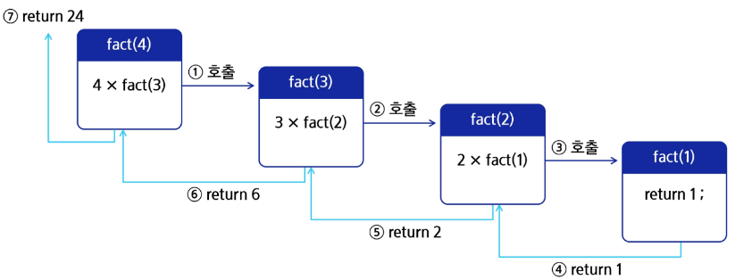

> 구조를 설명했을 때, 다음과 같이 1~7까지 가게 됨

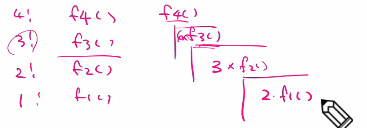

n * fact(n-1)를 불러오는데, 이는 다른 함수를 불러오는 것과 같다고 보면 됨

return은 호출했던 자리에 그 값을 그대로 두게 되는 것

> 피보나치 수열
: 0과 1로 시작하고 이전의 두 수 합을 다음 항으로 하는 수열

- 피보나치 수열의 i번째 값을 계산하는 함수 F를 정의
- 피보나치 수를 구하는 재귀함수
---

### **재귀함수의 기본형**

**- 현재 호출 단계와 목표 단계를 인자로 사용**

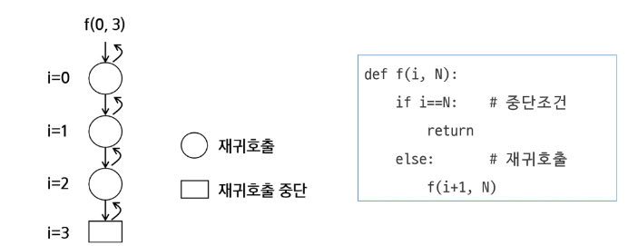

목표 단계에 가까워지도록 계속 i를 호출하는 형태임이 중요

### 모든 배열 원소에 접근하는 재귀함수

- 호출을 계속했다면 return도 호출 횟수만큼 실행해서 돌아나와야 함
- 호출 단계 i에서 arr[i] 원소에 접근하고, i가 배열의 크기와 같아지면 재귀호출을 중단

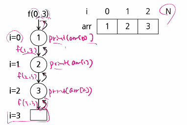

```
def f(i, N)  # 크기 N인 배열 arr[i]에 접근
    if i == N: #i와 N이 뭔지 주석을 항상 달아주기
        return
    else:
        print(arr[i])
        f(i+1, N)
```

#### 늘 함수 만들기 연습하기!!!

---
### [배열 원소 검색]

배열에 v가 있으면 1, 없으면 0을 리턴하는 함수
v = 5인 경우, arr에는 5가 없으므로 마지막 단계까지 호출하고 0을 리턴

찾지 못한 경우(실패)
: 계속 0이 리턴되어오게 됨. 중간 단계에서는 판단하지 않고 리턴되어 오는 값을 다음 단계로 무조건 전달해주면 되는 것.

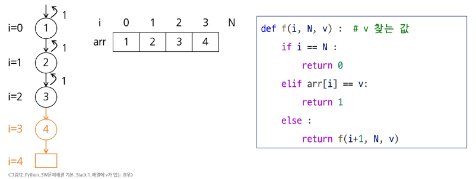

매 단계마다 세 변수에 대한 스택을 배당하여 배열 원소 v 검색을 진행하고, 재귀호출이 발생하게 되는 구조

---

#Memoization

> 피보나치 재귀호출의 문제점

**: 피보나치 수를 구하는 함수를 재귀함수로 구현한 알고리즘은 ```'엄청난 중복 호출이 존재한다'```는 문제 발생**

---

### 메모이제이션(Menoization)
: 컴퓨터 프로그램을 실행할 때 이전에 계산한 값을 메모리에 저장해 두고, 매번 다시 계산하지 않도록 하여 전반적,전체적 실행속도를 빠르게 하는 기술

> 메모이제이션을 적용한 피보나치
- 계산된 적 있는 피보나치 수는 저장된 값을 리턴

---
처음 memo[0], memo[1]은 알고 있고, 저장해두고 시작할 것


if 이후는 fibo1 수가 계산되지 않은 경우

---
# DP(동적계획법)

### 개념
동적계획법(Dynamic Programming, DP)은 **큰 문제를 작은 하위 문제로 나누어 해결한 뒤, 그 결과를 저장하고 재활용하여 전체 문제를 해결하는 알고리즘 설계 기법**이다.  
주로 **중복되는 하위 문제(Overlapping Subproblems)**와 **최적 부분 구조(Optimal Substructure)**를 가진 문제에서 사용된다.

### 핵심 아이디어
1. **분할(Divide)**: 문제를 더 작은 하위 문제로 나눈다.
2. **저장(Memoization / Tabulation)**: 계산한 하위 문제의 결과를 저장한다.
3. **재활용(Reuse)**: 저장된 결과를 불러와 불필요한 계산을 피한다.

---

### 📌 DP 적용이 가능한 문제
1. **최적 부분 구조 (Optimal Substructure)**  
   - 문제의 최적 해가 하위 문제의 최적 해로부터 쉽게 구성될 수 있어야 함  
   - 예: 최단 경로 문제, 배낭 문제(Knapsack), 피보나치 수열 등

[피보나치 수열을 DP로 구현]

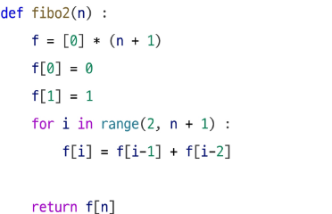

2. **중복 부분 문제 (Overlapping Subproblems)**  
   - 동일한 하위 문제가 여러 번 반복되어 나타나야 함  
   - 예: 재귀로 구하는 피보나치 수에서 동일 값이 여러 번 계산됨

---

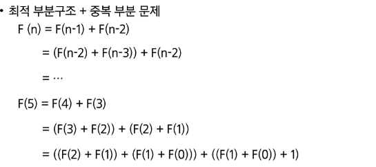

---

### 구현 방식
- **Top-down (Memoization)**: 재귀로 문제를 풀며, 계산된 값을 저장하여 재활용
- **Bottom-up (Tabulation)**: 작은 문제부터 차례대로 풀어 테이블에 저장

---

### 장단점
- **장점**: 중복 계산을 줄여 시간 복잡도를 낮춤
- **단점**: 저장 공간이 필요해 메모리 사용량이 늘어날 수 있음

---
# DFS
###```깊이 우선 탐색```

** 의미:  한 방향으로 가능한 한 깊게 탐색한 후, 더 이상 갈 곳이 없으면 되돌아와 다른 방향을 탐색**

비선형구조(1:N)인 그래프 구조는 그래프로 표현된 모든 자료를 빠짐없이 검색해야 함
여기서 두 가지가 존재하는데 그것이 DFS, BFS이다.
그 중 **DFS**를 오늘 알아보자.

> 동작 원리

1. 시작 정점의 한 방향으로 갈 수 있는 경로가 있는 곳까지 깊이 탐색해 나간다
2. 더 이상 갈 곳이 없게 되면 가장 마지막에 만났던 갈림길 간선이 있는 정점으로 되돌아와서 다른 방향의 정점으로 탐색을 계속 반복하여 결국 모든 정점을 방문하는 탐색방법

```
<가장 마지막에 만났던 갈림길의 정점>으로 되돌아가서 다시 깊이 우선 탐색을 반복해야 하므로 <후입선출(LIFO) 구조인 스택> 사용하는 것
```

> 알고리즘

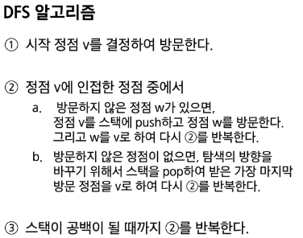

좀 전에 있던 곳을 스택에 넣고 (지나간 곳이라는 것을 표시해둠) 이동
스택에서 꺼내서 내가 지나온 곳으로 다시 돌아가서 갈림길의 다른 길로 가게 됨
지나온 곳을 돌아갈 때는 스택에서 꺼내오는 형식(뒷걸음질)
다른 길로 떠나는 것은 탐색이자 앞으로 이동한다고 생각하면 됨
탐색에는 갈림길 중 하나로 가고 되돌아갈 때는 스택에서 꺼낸 자리로(만) 이동할 수 있다고 생각하면 됨

---
72슬라이드 인덴트 에러 존재

**[정정된 코드]**
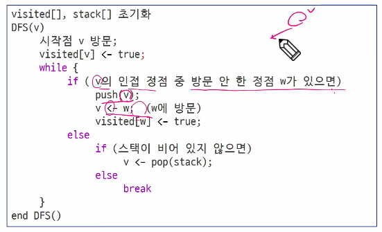

- 뭔가 남아있다면 pop하여 그 위치에서 다시 이동해보라는 것

- 아니라면 바로 탈출 유도

---

## 73~88 슬라이드 흐름 이해하기

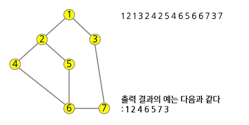

위는 인접 행렬 : 모든 정점과 다른 정점이 연결되어 있는지 보여줌
matrix[1][2] = True
matrix[2][1] = True??
화살표가 존재하고 머리가 2로 향하는 경우 False가 되고 (유향 그래프)
없는 경우는 양방향 관계 성립 가능 (무향 그래프)

아래는 인접 리스트 [그냥 1번과 연결되어 있는 친구들만 나열] 
lst[1] = [2,3]

뒤돌아간 것을 제외하고 처음 방문한 거만 표시하면 순서가 슬라이드 내 깊이 우선 탐색 경로가 됨

---

복습

print 만난다고 무조건 출력이 아니라, functionN(a,b,c)을 만나면 해당하는 N을 가지는 def function()(a,b,c)로 가게 되는 것
각각 함수에 맞는 순서를 기억해야 하고, 계속 쌓인다는 점에서 '스택'을 활용하게 되는 것

'''
7 8
1 2 1 3 2 4 2 5 4 6 5 6 6 7 3 7
'''

7은 정점의 수
8은 간선의 수

