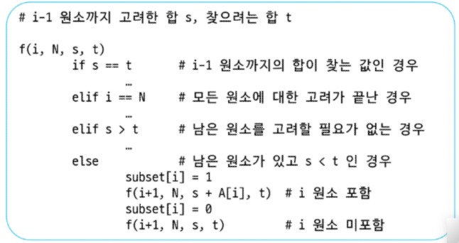

# 부분집합

> Backtracking 기법 활용해서 만드는 방법 

#### = 재귀랑 똑같음

(1) 후보군 추천
(2) 가지치기

bit = [0,0]
for i in range(2): #[0,1]
    bit[0] = i
        for j in range(2):
            ...
            print(bit)

이처럼 loop를 이용하는 데에는 갯수에 따른 한계가 있음. 하나의 코드로 모든 테스트케이스 통과해야 함.

> Powerset을 구하는 백트래킹 알고리즘

```python
# 알고리즘 1
def backtrack(a, k, n):  # a 주어진 배열, k 결정할 원소, n 원소 개수
    c = [0] * MAXCANDIDATES # 후보군 저장

    if k == n:
        process_solution(a, k)  # 답이면 원하는 작업을 한다
    else:
        ncandidates = construct_candidates(a, k, n, c)  # 후보(군) 추천 함수
        ⌊ 후보 수                           ⌊ 후보군 저장
        for i in range(ncandidates): # 결정된 후보 수에 따라 달라지기보다, 추천된 후보를 하나씩 사용하도록 설정
            a[k] = c[i]
            backtrack(a, k + 1, n)
```
```python
# 알고리즘 2
    
def construct_candidates(a, k, n, c):  
    c[0] = True                             # 원소의 포함 여부 (사용이 됐는지 안 됐는지 확인)
    c[1] = False
    return 2

def process_solution(a, k):  #개수 누적해서 출력해줌
    for i in range(k):
        if a[i]:
            print(num[i], end = ' ')
    print()

MAXCANDIDATES = 2
NMAX = 4
a = [0] * NMAX
num = [1,2,3,4]
backtrack(a, 0, 4)

```

# 순열

## 순열(Permutation) 개념

순열은 주어진 집합에서 원소들의 **배열**을 의미합니다. 주어진 원소들을 **순서대로** 배열하는 방법의 수를 나타내며, 각 배열은 순서가 중요합니다.

### 예시:
집합 {1, 2, 3}에서 원소를 선택하여 배열하는 방법은 다음과 같습니다:
- (1, 2, 3)
- (1, 3, 2)
- (2, 1, 3)
- (2, 3, 1)
- (3, 1, 2)
- (3, 2, 1)

총 6가지 방법이 있습니다.

### 코드 분석:
주어진 코드는 세 개의 숫자(1, 2, 3)에 대해 순열을 출력하는 코드입니다. 각 숫자는 **중복 없이** 선택되어야 하며, 출력되는 값들은 서로 다른 값들이 배열된 순열입니다.

```python
for i1 in range(1, 4):
    for i2 in range(1, 4):
        if i2 != i1:  # i2는 i1과 다르게 선택
            for i3 in range(1, 4):
                if i3 != i1 and i3 != i2:  # i3는 i1과 i2와 다르게 선택
                    print(i1, i2, i3)
```
> 순열의 중요성

- 순열은 다양한 문제에서 순서가 중요한 경우에 자주 사용됩니다. 예를 들어, 경로 탐색, 일정 계획, 조합 게임 등에서 순열을 사용합니다.

- n! (n 팩토리얼)은 n개의 원소로 만들 수 있는 순열의 수를 나타냅니다.

```python
# <알고리즘 1>

def backtrack(a, k, n):
    c = [0] * MAXCANDIDATES

    if k == n:
        for i in range(0, k):
            print(a[i], end=" ")
        print()
    else:
        ncandidates = construct_candidates(a, k, n, c)
        for i in range(ncandidates):
            a[k] = c[i]
            backtrack(a, k + 1, n)

#<알고리즘 2>

def construct_candidates(a, k, n, c): 
    in_perm = [False] * (NMAX + 1) # in_perm은 원소의 포함 여부 (사용이 됐는지 안 됐는지 확인)

    for i in range(k):
        in_perm[a[i]] = True

    ncandidates = 0
    for i in range(1, NMAX + 1):
        if in_perm[i] == False: #사용된 거 아닌 거 차장서 
            c[ncandidates] = i
            ncandidates += 1
    return ncandidates
    

# <알고리즘 3>

MAXCANDIDATES = 3
NMAX = 3
a = [0]*NMAX
backtrack(a, 0, 3)

```

# 가지치기

# 부분집합의 합 (Subset Sum)

---

## 1. 기본 개념
- 집합의 각 원소는 **포함(1)** 또는 **제외(0)** 두 가지 선택이 가능하다.  
- i번째 원소의 포함 여부를 결정하면, 그때까지의 부분집합 합을 알 수 있다.  
- 찾고자 하는 합보다 이미 커지면 더 이상 고려할 필요가 없다 (**가지치기**).  

---

## 2. 예시 집합
- 집합: `A = [1, 2, 3]`  
- 인덱스 i = 0, 1, 2 순서대로 원소 선택 여부를 결정한다.  

---

## 3. 트리 구조
부분집합의 모든 경우를 **이진 트리** 형태로 표현할 수 있다.

- **루트 (i=0, 합=0)**  
  - 왼쪽: 원소 1 포함 → 합=1  
  - 오른쪽: 원소 1 제외 → 합=0  

- **다음 단계 (i=1, 원소=2)**  
  - 이전 합에 2를 더하거나 그대로 둔다.  

- **마지막 단계 (i=2, 원소=3)**  
  - 이전 합에 3을 더하거나 그대로 둔다.  

---

## 4. 결과 (선택 여부 → 이진수 표현)
- `111` → (1+2+3=6)  
- `110` → (1+2=3)  
- `101` → (1+3=4)  
- `011` → (2+3=5)  
- `100` → (1)  
- `010` → (2)  
- `001` → (3)  
- `000` → (0, 공집합)  

---

## 5. 함수 표현
### f(i, N, s, t)

- i: 현재 고려하는 원소 인덱스  
- N: 전체 원소 개수  
- s: 지금까지 선택한 원소의 합  
- t: 목표 합(Target)  

---

✅ 정리:  
- 부분집합 문제는 원소 선택 여부(포함/제외)를 트리로 확장해 모든 경우를 탐색한다.  
- 목표 합 `t`를 넘으면 더 이상 탐색할 필요가 없다.  
- 따라서 **재귀 + 백트래킹** 구조로 효율적으로 해결할 수 있다.  

---
#pruning_backtrack

i가 0번 원소를 포함하거나 하지 않거나를 나눠서 bit[i] = 1, bit[i] =0 로 각각 정하는 것

아래 코드는 집합 `A`의 원소를 **포함/미포함**으로 나누어 모든 부분집합을 탐색하면서,
합이 목표값 `t`(= `key`)가 되는 경우의 수를 세는 **백트래킹 + 프루닝**(가지치기) 구현 코드임.

```python
def f(i, k, s, t):  # i: 현재 인덱스, k: 집합 크기, s: 지금까지의 합, t: 목표 합
    global cnt
    global fcnt
    fcnt += 1
    if s > t:                # (프루닝1) 합이 목표를 초과하면 더 내려갈 필요 없음 (A가 양수일 때 안전)
        return
    elif s == t:             # (프루닝2) 이미 목표 합 달성 → 남은 원소 볼 필요 없음 (A가 양수일 때 안전)
        cnt += 1             # 정답 1건 추가
        return
    elif i == k:             # (베이스) 모든 원소를 다 고려함
        return
    else:
        bit[i] = 1
        f(i+1, k, s + A[i], t)  # i번째 원소를 포함
        bit[i] = 0
        f(i+1, k, s, t)         # i번째 원소를 미포함

#A = [1,2,3,4,5,6,7,8,9,10]
N = 10
A = [i for i in range(1, N+1)]  # [1..10], 모든 원소가 양수

key = 55
cnt = 0            # 해(정답) 개수
bit = [0] * N      # 선택 여부 기록용 (현재 코드는 카운팅만 하므로 시각화 용도)
fcnt = 0           # f 호출 횟수(탐색한 노드 수)
f(0, N, 0, key)
print(cnt, fcnt)   # cnt: 합이 key인 부분집합 수, fcnt: 총 호출 횟수
```
### 2) 매개변수 / 전역 변수 설명

- **i** : 현재 탐색 중인 원소의 인덱스(0부터 시작).
- **k** : 전체 집합의 크기(= N).
- **s** : 지금까지 선택한 원소들의 합(누적합).
- **t** : 목표 합(key).
- **bit[i]** : i번째 원소를 선택했는지 여부(1=선택, 0=미선택).
- **cnt** : 목표 합을 만족하는 부분집합(정답)의 개수.
- **fcnt** : 함수 `f`가 호출된 횟수(탐색한 노드 수).

---

### 3) 동작 흐름 (한 줄씩 해석)

1. `fcnt += 1`  
   → 함수가 호출될 때마다 탐색한 노드 수 증가.

2. `if s > t: return`  
   → **프루닝1**. 배열 A가 모두 양수일 경우, 합이 이미 목표를 초과하면 더 이상 내려갈 필요가 없음.

3. `elif s == t: cnt += 1; return`  
   → **프루닝2**. 목표 합에 도달했을 경우, 정답 1건을 추가하고 종료.  
   남은 원소를 더 고려하지 않아도 됨(모두 양수라서 더하면 무조건 초과).

4. `elif i == k: return`  
   → 집합의 모든 원소를 다 확인했는데 합이 목표와 맞지 않으면 종료.

5. `else:`  
   - `bit[i] = 1` → 현재 원소를 선택하고 재귀 호출.  
   - `bit[i] = 0` → 현재 원소를 선택하지 않고 재귀 호출.

---

### 4) 실행 결과 분석 (예제 입력)

- 집합 A = [1,2,3,...,10]  
- 목표 key = 55  
- 전체 합 = 55

따라서 **모든 원소를 선택한 경우**에만 합이 55가 됨.  
→ 정답(`cnt`)은 1.

탐색 호출 횟수(`fcnt`)는 사실상 전수 탐색 트리 크기와 동일.  
깊이 N=10의 이진 트리 노드 수:  
\[
2^{N+1} - 1 = 2^{11} - 1 = 2047
\]

출력:
1 2047

---

### 5) 프루닝 조건의 타당성

- `s > t` 컷 → **양수 배열일 때만** 안전.  
- `s == t` 컷 → 역시 **양수 배열일 때만** 안전.  
  만약 0이 포함되면 같은 합을 만드는 여러 조합(0 선택/미선택)이 있는데, 이 코드는 조기 종료로 인해 그 경우를 세지 않음.

---

### 6) 개선 가능성

- **상한 프루닝 추가**  
  남은 원소의 합을 `rem[i]`라 할 때:  
  `if s + rem[i] < t: return`  
  → 남은 원소를 모두 더해도 목표에 못 미치는 경우는 컷 가능.

---

### 7) 요약

- 이 코드는 부분집합의 합 문제를 **백트래킹**으로 푼 기본형.  
- `s > t`, `s == t` 조건으로 **양수 배열에서 안전한 프루닝**을 적용.  
- 예제 입력에서는 정답은 1개, 호출 횟수는 2047.  
- 0 또는 음수가 포함되면 프루닝 논리를 반드시 재검토해야 한다.

69 슬라이드 내용 다시 강의 들으면서 정리하기

포함 시키기로 하면 더하고, 아니면 안 더했지만
남은 합을 구할 때는 이전까지의 값 rs에서 A[i]를 빼는 것 



일단 위 내용부터 제대로 숙지하기

---
# 순열 2

> A[1,2,3]의 모든 원소를 사용한 순열

## 자리교환으로 순열 생성
```python
f(i,N)
    if i == N    # 순열 완성
    
    else
            가능한 모든 원소에 대해
                p[i] 결정
                f(i+1, N)
                p[i] 복구
```

### 재귀 & 백트래킹

## 1) 아이디어
- 순열은 배열 `P`에서 각 위치에 어떤 원소를 둘지를 결정하는 과정.
- 인덱스 `i`에서 가능한 원소를 모두 시도 → 재귀적으로 다음 인덱스로 이동.
- 모든 위치가 정해지면 순열 하나가 완성된다.
- 재귀에서 돌아올 때는 **swap으로 원상 복구(backtracking)** 하여 다른 경우를 시도한다.

---

## 2) 순서도 설명
1. `i=0`일 때, `P[0]` 자리에 올 수 있는 모든 원소(1, 2, 3)를 차례로 놓는다.  
2. `i=1`일 때, 남은 원소들 중 하나를 `P[1]`에 둔다.  
3. `i=2`일 때, 마지막 남은 원소를 놓으면 순열 완성.  
4. 한 경우가 끝나면 원래 상태로 복구하고 다른 선택을 시도한다.  

---

## 3) 파이썬 코드 예시

```python
def perm(i, N):
    if i == N:   # 모든 자리를 채우면 출력
        print(P)
    else:
        for j in range(i, N):
            # i번째 자리에 올 수 있는 원소를 바꿔가며 시도
            P[i], P[j] = P[j], P[i]   # swap으로 P[i] 결정
            perm(i + 1, N)            # 다음 인덱스 재귀 #i+1자리 결정
            P[i], P[j] = P[j], P[i]   # swap으로 복구 (backtracking)

# 예제 실행
P = [1, 2, 3]
N = 3
# perm(0, len(P))
perm(0, N)
```

> 5일차 - 배열 최소 합

* p[i] : 행에서 선택한 열번호
* if min_v > s:
    min_v = s
  
* else:
    p[i] ↔ P[j]
    f(i+1,k,s+A[i][p[i]])
    p[i] ↔ P[j]

=> 최소보다 큰 경우 잘라버리기

+ 0의 0 제곱은 1이다

---
# partjiphap.py  설명

## 0) 문제 정의
- 리스트 `lst = [1,2,3,4,5]`에서 **부분집합의 합이 S 이하**(여기선 `S=5`)인 모든 부분집합을 구한다.

---

## 1) 핵심 아이디어(백트래킹)
- **결정 문제로 쪼개기**: 인덱스 `idx`에서 `lst[idx]`를 **포함/미포함** 두 가지로 나눠 재귀 호출.
- **상태 유지**  
  - `selected`: 각 원소를 선택(1)/미선택(0)했는지 기록하는 배열(= 방문/선택 상태).  
  - `s`: 현재까지 선택한 원소들의 **누적합**.  
- **가지치기(Pruning)**: `s > S`인 순간 **이후는 볼 필요 없음**(양수 리스트일 때 안전).  
  → 남은 원소를 더하면 합이 더 커질 뿐이므로 정답이 될 수 없다.

---

## 2) 매개변수 의미
- **idx**: 지금 결정할 원소의 인덱스(0…N).  
- **selected**: 길이 N의 0/1 배열. `selected[i]=1`이면 `lst[i]`를 부분집합에 포함.  
- **s**: `0..idx-1`까지에서 선택된 원소들의 누적합.  
- **불변식**: 재귀 진입 시점마다 `s == sum(lst[j] for j < idx if selected[j]==1)`가 성립.

---

## 3) 코드 라인별 흐름

```python
def make_set(idx, selected, s):

    # (0) 가지치기: 현재 누적합이 한계를 넘으면 중단
    if s > S:
        return

    # (1) 종료 조건: 모든 원소에 대해 선택/미선택 결정을 마침
    if idx == N:
        subset = []
        for i in range(N):
            if selected[i]:
                subset.append(lst[i])
        print(subset)  # s <= S 보장(양수일 때), 조건 만족 부분집합 출력
        return

    # (2) 분기: idx번째 원소 '포함' 가지
    selected[idx] = 1
    make_set(idx + 1, selected, s + lst[idx])

    # (3) 분기: idx번째 원소 '미포함' 가지
    selected[idx] = 0
    make_set(idx + 1, selected, s)

