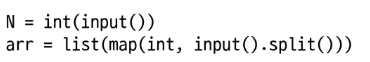
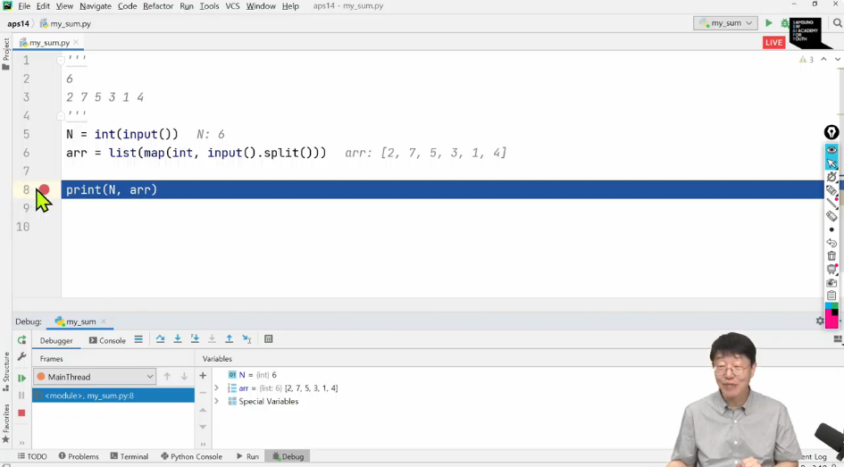
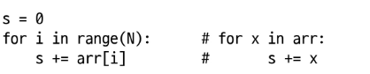
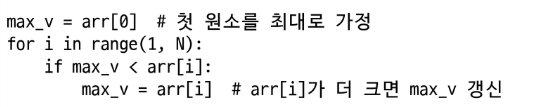
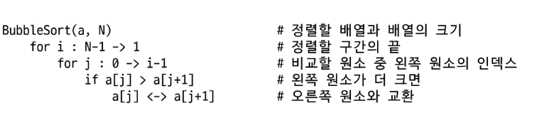
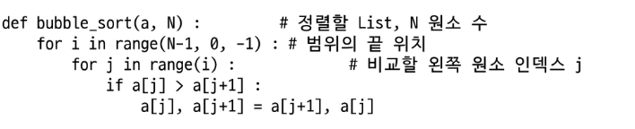

**알고리즘**

: 문제를 해결하기 위한 절차나 방법


내장함수 없이 동작 원리를 이해하는 것이 목표.

외워질 때까지 반복해서 머리에 넣도록 하고, 손으로 따라 입력하여 자연스럽게 체화되도록 하기


* 의사코드(슈도코드, 코드를 흉내냈다고 해서 의사코드)와 순서도
* 컴퓨터 분야에서 알고리즘 표현하는 법


좋은 알고리즘이란?

* **\*정확성** : 얼마나 정확하게 동작하는가
* 작업량 : 얼마나 적은 연산으로 원하는 결과를 얻어내는가
* 메모리 사용량 : 얼마나 적은 메모리를 사용하는가
* 단순성 : 얼마나 단순한가
* 최적성 : 더 이상 개선할 여지 없이 최적화되었는가


알고리즘의 성능

* 주어진 문제를 해결하기 위하여 여러 개의 다양한 알고리즘이 가능

 	- 어떤 알고리즘을 사용해야 하는가를 고려해야 함

* 알고리즘의 성능 분석 필요

 	- 성능 분석의 기준으로 알고리즘의 작업량을 비교함


알고리즘의 시간 복잡도

* 알고리즘 작업량을 표현할 때 시간 복잡도로 표현
* 실제 걸리는 시간을 측정
* 실행되는 명령문 개수를 계산


표시법

빅-오 표기법을 언급하는 경우가 많음

시간 복잡도 함수 중에서 가장 큰 영향력을 주는 n에 대한 항만을 표시

계수는 생략하여 표시


ex. O(3n+2) = O(3n) = O(n)

           최고차항(3n)만 선택 -> 계수 3 제거


n개의 데이터를 입력받아 저장한 후 각 데이터에 1씩 증가시킨 후 각 데이터를 화면에 출력하는 알고리즘의 시간 복잡도는?

O(n)


요소 수사 증가함에 따라 각기 다른 시간 복잡도의 알고리즘은 다른 연산 수를 보임


---


# **배열**


: 일정한 자료형의 변수들을 하나의 이름으로 열거하여 사용하는 자료 구조


* 프로그램 내에서 여러 개의 변수가 필요할 때
* 배열을 사용하여 하나의 선언을 통해 둘 이상의 변수를 선언
* 단순히 다수의 변수 선언을 의미하는 것이 아니라, 다수의 변수로는 하기 힘든 작업을 배열을 활용해 쉽게 할 수 있음.
* 실제로 메모리에서도 연속된 공간을 사용함


1차원 배열

* 배열을 선언할 때에는 프로그램에서 사용할 배열 이름이 필요
* 입력받은 정수를 1차원 배열에 저장하는 법

 - 첫 줄에 양수의 개수 N이 주어짐 (5<= N <= 1000)

  - 다음 줄에 빈칸으로 구분된 N개의 양수 Ai가 주어짐 (1<= Ai <= 1000000)

* 정수 N 을 입력받고, 공백으로 구분된 정수들을 리스트로 입력받는 코드


- 노트를 통해 그림을 그려봐야 함.
- input은 데이터 그자체로 불러오고 split은 띄어쓰기를 토대로 구분하여 각각 데려옴




IDE 파이참을 이용한 코드 디버깅과 런

역량평가를 위해 사용 연습하기(공식 버전은 PyPy)

---

**배열 원소의 합 s 계산하기**
: N개라는 것을 알면 첫줄에서 N이 주어지고, 읽어놓은 외부 N을 활옹해서 코드 진행하면 됨. 따로 arr len 구하지 말고.



실력 향상을 위해 일일히 타자를 쳐서 코드 체크해보기.

---

**배열 원소의 최댓값 max_v 찾기**



내게 주어진 값 중 가장 작은 값으로 초기화를 하거나, 절댓값보다 작은 값으로 초기화를 하기.
첫 원소를 최대로 가정하는 경우가 가장 많음.(누가 큰지 어떤 숫자가 나올지 모르니까)

크기에 해당하는 위치에 올 때 연산이 끝남

range를 먼저 작동시켜서 1~n-1를 만들어놓고 하나씩 꺼내온다고 이해하면 됨.

코드 할당문 순서를 맞추는 거 까먹지 말기

---

**배열 원소 중 최댓값의 인덱스 max_idx 찾기**

첫 원소를 최대로 가정하고, 1번부터 N가지 비교해서 값을 갱신하며 최댓값 인덱스 찾아야 함
max_v를 찾고 그 인덱스를 찾는 것보다 간결하고 최적화된 코드이니 교재 보고 다시 타이핑해서 익히기

print(max_idx+1(순서), arr(max_idx)(idx 값))

Q. 최댓값이 여러 개인 경우?
- 가장 왼쪽의 최댓값 인덱스
- 먼저 나온 값의 인덱스를 채택하거나, 마지막 인덱스를 찾는 경우가 존재
- 더 크지 않으면 갱신하지 말라는 조건이 있는 경우 가장 왼쪽의 최댓값 인덱스가 채택
- 더 큰 값 혹은 같은 값이면 갱신하라고 하는 경우 마지막 인덱스를 찾게 됨

---
**찾는 값이 배열에 있으면 해당 원소의 인덱스, 없으면 -1을 idx에 넣기**
- 정수 N을 입력받고, 공백으로 구분된 정수들을 리스트로 입력 받는 코드
- 배열 원소의 최댓값의 마지막 인덱스를 찾는 코드
```
idx = -1                # 찾는 값이 없다고 가정
for i in range(N):    
    if arr[i] == V:     # arr[i]가 찾는 값이면
        idx = i         # 인덱스 저장
        break           # for i
```

---
# 정렬

: 2개 이상의 자료를 **키**(특정 기준)에 의해 작은 값부터 큰 값(오름차순 : ascending), 혹은 그 반대의 순서대로(내림차순 : descending) 재배열하는 알고리즘


[종류]

버블 정렬/퀵 정렬/카운팅 정렬/삽입 정렬/선택 정렬/병합 정렬

---
**버블 정렬**

: 인접한 두 개의 원소를 비교하며 자리를 계속 교환하는 방식

1. 첫 번째 원소부터 인접한 원소끼리 계속 자리를 교환하면서 맨 마지막 자리까지 이동한다
2. 한 단계가 끝나면 가장 큰 원소가 마지막 자리로 정렬
3. 교환하며 자리를 이동하는 모습이 물 위로 올라오는 거품 모양과 유사하여 버블 정렬이라 함

시간 복잡도

: O(n^2)

---
**버블 정렬 알고리즘**

- 배열을 활용한 버블 정렬 알고리즘 예시(오름차순)
- 슈도 코드

- 파이썬 코드


그림과 슈도코드를 연습한 다음에, 파이썬으로 어떻게 표현할지 고민해보면서 빈 화면에서 코드를 채워갈 수 있도록 하기

def bubble_sort(a,N):
  for i in range(N-1, 0, -1): #구간의 끝 i : N-1 -> 1 # 0은 생성이 안 됨. 필요없어서
    for j in range(i): 
      if a[j] > a[j+1]:
        a[j], a[j+1] = a[j+1]. a[j]

arr = [55, 7, 78, 12, 42]
bubble_sort(arr, len(arr))

print(arr)


Q. 궁금한 게 이 경우에 인덱스 0도 포함이 되는 걸까요? range에서 끝 숫자, 이 경우 0,는 포함이 되지 않는다고 설명을 들었던 기억이 있어서요.

A. 왼쪽과 비교를 하기 때문에 0까지는 생성을 하지 않는 거군요.

---

**카운팅 정렬**

: 항목들의 순서를 결정하기 위해 집합에 각 항목이 몇 개씩 있는지 세는 작업을 하여, 선형 시간에 정렬하는 효율적인 방식

**제한 사항**

1. 정수나 정수로 표현할 수 있는 자료에 대해서만 적용 가능
   - 각 항목의 발생 횟수를 기록하기 위해, 정수 항목으로 인덱스 되는 카운트들의 배열을 사용하기 때문
2. 카운트들을 위한 충분한 공간을 할당하려면 집합 내 가장 큰 정수를 알아야 함

**시간 복잡도**
- O(n+k) : n은 리스트 길이, k는 정수의 최댓값
  
---
파이참 Pypy에서는 경로에 영어만! 있어야 실행 가능

